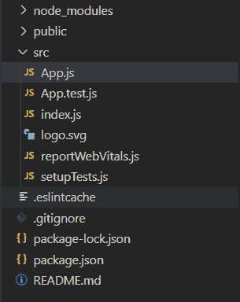
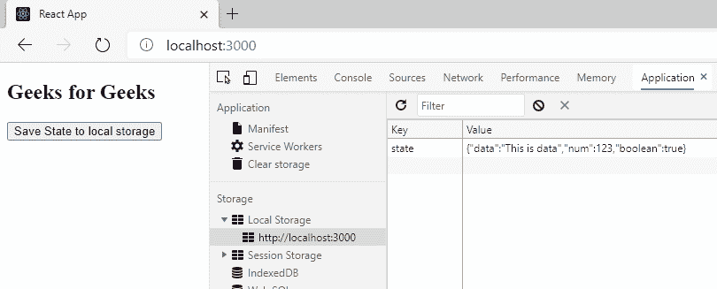

# 如何使用 ReactJS 将新状态保存到本地 JSON？

> 原文:[https://www . geesforgeks . org/how-save-new-state-to-local-JSON-using-reactjs/](https://www.geeksforgeeks.org/how-to-save-new-state-to-local-json-using-reactjs/)

有时我们需要以 JSON 格式在浏览器上本地存储状态。我们可以将任何信息保存到浏览器的本地存储中，并在以后的任何时候访问这些信息。

**设置环境和执行:**

*   **步骤 1:** 使用以下命令创建反应应用。

    ```
    npx create-react-app foldername
    ```

*   **步骤 2:** 创建项目文件夹，即文件夹名称后，使用以下命令移动到该文件夹:

    ```
    cd foldername
    ```

>

**项目结构:**如下图。



## App.js

```
import React, { Component }  from 'react'; 

class App extends Component { 

  state = { 
    data: "This is data", 
    num: 123, 
    boolean: true, 
  } 

  // save data to localStorage 
  saveStateToLocalStorage = () => { 
    localStorage.setItem('state', JSON.stringify(this.state)); 
  } 

  // Fetch data from local storage 
  getStateFromLocalStorage = () => { 
    let data = localStorage.getItem('state'); 
    if(data !== undefined) { 
      this.setState(JSON.parse(data)); 
    } 
  } 

  componentDidMount() { 
    // Fetch data from local storage 
    this.getStateFromLocalStorage(); 
  } 

  render() { 
    return ( 
      <div> 
        <h2>GeeksforGeeks</h2> 
        <button onClick={this.saveStateToLocalStorage}> 
          Save State to local storage\ 
        </button> 
      </div> 
    ); 
  } 
} 

export default App;
```

**运行应用程序的步骤:**从项目的根目录使用以下命令运行应用程序:

```
npm start
```

**输出:**现在打开浏览器，转到***http://localhost:3000/***，会看到如下输出。

