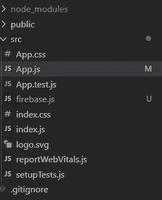
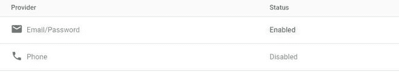

# 如何使用 ReactJS 发送带有 firebase 的邮件验证链接？

> 原文:[https://www . geesforgeks . org/how-send-email-verification-link-with-firebase-use-reactjs/](https://www.geeksforgeeks.org/how-to-send-email-verification-link-with-firebase-using-reactjs/)

在本文中，我们将看到如何使用 React.js 发送带有 firebase 的电子邮件验证链接

为你的反应项目设置一个火焰基地。

**创建反应应用程序并安装模块。**

*   **步骤 1:** 使用以下命令创建一个 React myapp。

    ```
    npx create-react-app myapp
    ```

*   **步骤 2:** 创建项目文件夹(即 myapp)后，使用以下命令将其移动到该文件夹。

    ```
    cd myapp
    ```

**项目结构:**项目结构会是这样的。



**步骤 3:** 创建 ReactJS 应用程序后，使用以下命令安装 firebase 模块。

```
npm install firebase@8.3.1 --save
```

**第 4 步:**转到你的 firebase 仪表盘，创建一个新项目并复制你的凭证。

```
const firebaseConfig = {
      apiKey: "your api key",
      authDomain: "your credentials",
      projectId: "your credentials",
      storageBucket: "your credentials",
      messagingSenderId: "your credentials",
      appId: "your credentials"
};
```

**步骤 5:** 现在使用您的登录方法中的电子邮件和密码启用登录。



**示例:**通过使用以下代码创建 firebase.js 文件，将 firebase 初始化到您的项目中。

## 火库. js

```
import firebase from 'firebase';

const firebaseConfig = {
    // Your credentials
};

firebase.initializeApp(firebaseConfig);
var auth = firebase.auth();
export default auth;
```