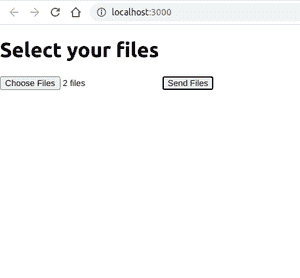
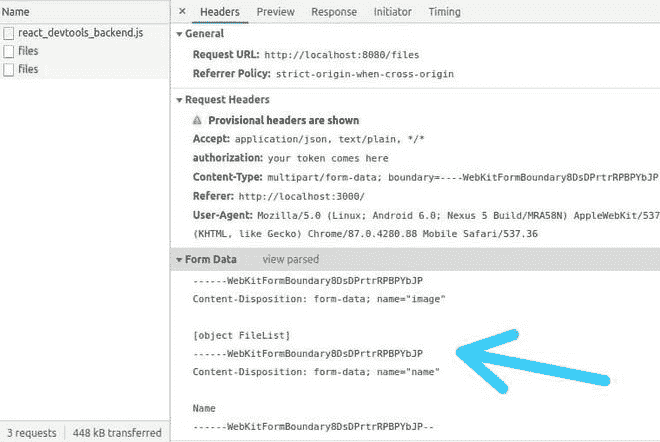

# 如何在 ReactJS 中使用 axios 向一个 API 发送一个或多个文件？

> 原文:[https://www . geeksforgeeks . org/如何使用 axios in-reactjs 将一个或多个文件发送到 API/](https://www.geeksforgeeks.org/how-to-send-one-or-more-files-to-an-api-using-axios-in-reactjs/)

假设你想用 **Axios 从前端，也就是 **React app** 发送多个文件到服务器。**为此，有如下两种方法:

*   发送多个请求，同时在每个请求中附加一个文件。
*   发送一个请求，同时附加该请求本身中的多个文件。

我们将按照第二种方法进行**，这里有几点来证明这个动作:**

1.  在第一种方法中，我们必须发出额外的请求才能在服务器上发送多个文件，而在第二种方法中，我们只需发出一个请求。
2.  第一种方法会导致计算能力的浪费，如果你使用像谷歌云平台(GCP)或亚马逊网络服务(AWS)这样的云服务提供商，这可能会增加额外的成本。
3.  第一种方法不容易处理后端服务器的文件，而第二种方法更简单。

**创建反应应用程序:**

**步骤 1:** 使用以下命令创建一个反应应用程序:

```jsx
npx create-react-app multiple_files
```

**步骤 2:** 使用以下命令移动到包含项目的目录:

```jsx
cd multiple_files
```

**步骤 3:** 使用以下命令安装 **axios** 模块:

```jsx
npm install axios
```

**步骤 4:** 使用以下命令启动服务器:

```jsx
npm start
```

**项目结构:**以下是项目的目录结构:


项目结构

**第二种方法的代码:**

**文件名:App.js**

## java 描述语言

```jsx
import React from "react";
import axios from "axios";

class App extends React.Component {
  state = {
    files: null,
  };

  handleFile(e) {
    // Getting the files from the input
    let files = e.target.files;
    this.setState({ files });
  }

  handleUpload(e) {
    let files = this.state.files;

    let formData = new FormData();

    //Adding files to the formdata
    formData.append("image", files);
    formData.append("name", "Name");

    axios({
      // Endpoint to send files
      url: "http://localhost:8080/files",
      method: "POST",
      headers: {
        // Add any auth token here
        authorization: "your token comes here",
      },
      // Attaching the form data
      data: formData,
    })
      .then((res) => { }) // Handle the response from backend here
      .catch((err) => { }); // Catch errors if any
  }

  render() {
    return (
      <div>
        <h1>Select your files</h1>
        <input
          type="file"
          multiple="multiple"  //To select multiple files
          onChange={(e) => this.handleFile(e)}
        />
        <button onClick={(e) => this.handleUpload(e)}
        >Send Files</button>
      </div>
    );
  }
}

export default App;
```

**输出:**

```jsx
Before clicking 'Send Files' Button:
```



选择了多个文件的浏览器输出

要选择文件，点击**选择文件**按钮，选择多个文件。选择所需文件后，点击**发送文件**按钮。

```jsx
After clicking 'Send Files' Button:
```



发送带有文件的请求

在上面的照片中可以看到，您选择的文件在发送到服务器时已经以数据的形式成功附加。

**注意:**您可以在后端使用适当的包来处理这些文件，并可以相应地从服务器发送响应。