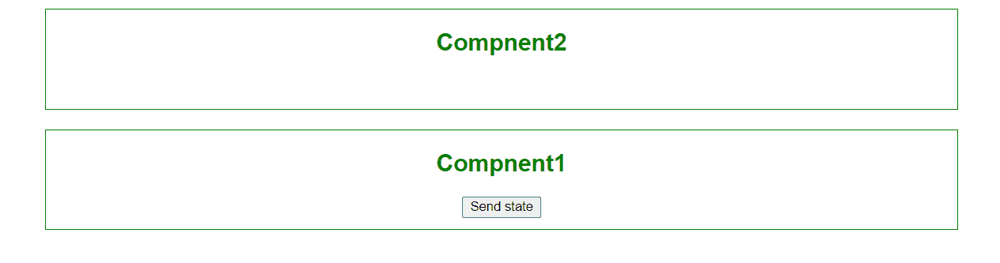

# 如何在 onClick React 中向另一个组件发送状态/道具？

> 原文:[https://www . geeksforgeeks . org/如何将状态道具发送到另一个组件-in-react-onclick/](https://www.geeksforgeeks.org/how-to-send-state-props-to-another-component-in-react-with-onclick/)

[**道具**](https://www.geeksforgeeks.org/reactjs-props-set-1/?ref=lbp) 和 [**状态**](https://www.geeksforgeeks.org/reactjs-state-react/?ref=rp) 是 React 的主要概念。实际上，只有道具和/或状态的改变才会触发 React 来重新呈现你的组件，并有可能在浏览器中更新 DOM

[**道具**](https://www.geeksforgeeks.org/reactjs-props-set-1/?ref=lbp) **:** 可以将数据从父组件传递给子组件。

[**状态**](https://www.geeksforgeeks.org/reactjs-state-react/?ref=rp) **:** 虽然道具允许您将数据从父组件传递到子组件，但是状态用于更改组件，嗯，从内部更改状态。对状态的更改也会触发用户界面更新。

**使用 onClick 事件将状态/道具发送到另一个组件:**所以首先我们将状态/道具存储到父组件中，即在哪个组件中触发 onClick 事件。然后，为了将状态传递给另一个组件，我们简单地将其作为一个道具传递。为了更好的理解，请看这个例子。

**对于基于类的组件。**

1.  **App.js** :

    ## java 描述语言

    ```
    // First Component i.e. App

    import React, { Component } from 'react';
    import './App.css'
    import Component2 from './Component2';

    class App extends Component {  

        state={data:""}

        changeState = () => {  
          this.setState({data:`state/props of parent component 
          is send by onClick event to another component`}); 
             }; 

        render(){   
            return (     
                <div className="App">  
                    <Component2 data={this.state.data} />   
                    <div className="main-cointainer">
                        <h2>Compnent1</h2> 
              <button  onClick={this.changeState} type="button"> 
                 Send state 
              </button>    
                    </div>
                </div>   
            );          
        }}

        export default App; 
    ```

2.  **组件 2.js:**

    ## java 描述语言

    ```
    import React from 'react';

    const Component2 = (props) => {
        return (
            <div className="main-cointainer">
                <h2>Compnent2</h2> 

    <p>{props.data} </p>

            </div>
        )
    }

    export default Component2;
    ```

**对于基于功能的组件。**

1.  **App.js:**

    ## java 描述语言

    ```
    // First component i.e App

    import React, { useState } from 'react';
    import './App.css'
    import Component2 from './Component2';

    function App() {

        const [state, setstate] = useState({data:""})

        const changeState = () => {  
            setstate({data:`state/props of parent component 
            is send by onClick event to another component`}); 
           }; 

        return (  
            <div className="App">  
                <Component2 data={state.data} />   
                <div className="main-cointainer">
                    <h2>Compnent1</h2> 
                    <button  onClick={changeState} type="button">
                      Send state 
                    </button>    
                </div>
            </div>                 
        );
     }

     export default App;
    ```

2.  **组件 2.js:**

    ## java 描述语言

    ```
    // Second Component
    import React from 'react';
    import './Component2.css'

    export default function Component2(props) {
        return (
            <div className="main-cointainer">
                <h2>Compnent2</h2> 

    <p>{props.data} </p>

            </div>
        )
    }
    ```

**输出:**

1.  **点击按钮前:**

    

2.  **点击按钮后:**

    