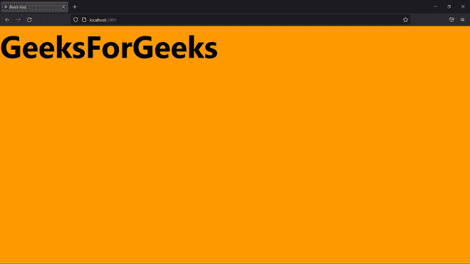

# 如何在 ReactJS 中设置背景图片？

> 原文:[https://www . geeksforgeeks . org/how-set-background-images-in-reactjs/](https://www.geeksforgeeks.org/how-to-set-background-images-in-reactjs/)

有时，用户需要在开发 react app 时设置背景图像。在本文中，我们将讨论在 react app 中设置背景图像的所有方法。

我们将讨论如何使用 [*内联 CSS*](https://www.geeksforgeeks.org/how-to-set-a-background-image-with-react-inline-styles/) 和外部 CSS 设置背景图像。我们还将讨论几种添加背景图像网址的方法。

**先决条件:**本项目的先决条件是:

*   [反应](https://www.geeksforgeeks.org/react-js-introduction-working/)

**创建反应应用程序**

**步骤 1:** 用户可以使用下面的命令创建一个新的 react 项目。

```
npx create-react-app testapp
```

**步骤 2:** 接下来，用户需要使用下面的命令从终端移动到测试 app 项目文件夹。

```
cd testapp
```

**项目结构:**看起来像下图。


**方法 1:使用内联 CSS:** 在这个方法中，我们在元素本身内部添加样式属性。

**文件名:App.js**

在 App.js 中，我们将在 div 元素中添加一个样式属性，并使用内嵌 CSS 为 div 元素设置背景图像。

## java 描述语言

```
import React, { Component } from 'react';

class App extends Component {
  render() {
    const myStyle={
        backgroundImage: 
 "url('https://media.geeksforgeeks.org/wp-content/uploads/rk.png')",
        height:'100vh',
        marginTop:'-70px',
        fontSize:'50px',
        backgroundSize: 'cover',
        backgroundRepeat: 'no-repeat',
    };
    return (
      <div style={myStyle}>
        <h1> geeksforgeeks </h1>
      </div>
    );
  }
}

export default App;
```

**输出:**



**方法二:使用外部 CSS:** 在这个方法中，我们添加一个外部 CSS 文件，为 react 组件设置一个背景图像。

**文件名:App.js**

在 App.js 中，我们将添加一个带有 className 属性的简单 div 元素。此外，我们导入一个外部 CSS 文件来设置 div 元素的背景图像。

## java 描述语言

```
import React, { Component } from 'react';
import './App.css';

class App extends Component {
  render() {
    return (
      <div  className="GeeksForGeeks">
      <h1>GeeksForGeeks</h1>
      </div>
    );
  }
}

export default App;
```

**文件名： 应用程序.css**

在 App.css 中，我们将在 App.js 文件中添加一个代码样式的 react 组件。我们将使用类名属性从 App.js 文件中访问 div 元素，并设置背景图像。

## 半铸钢ˌ钢性铸铁(Cast Semi-Steel)

```
.GeeksForGeeks {
  background-image: 
  url(
"https://media.geeksforgeeks.org/wp-content/uploads/rk.png");
  background-size: "cover";
  height: 100vh;
  margin-top: -70px;
  font-size:50px;
  background-repeat:no-repeat; 
}
```

**输出:**


**方法三:使用绝对 URL:** 用户可以使用环境变量通过绝对 URL 直接从*public/***T5】文件夹访问背景图片。在使用此方法之前，不要忘记在公共文件夹中添加图像，否则会显示编译错误。**

**文件名:App.js**

在这里，我们将添加代码来使用内嵌 CSS 和环境变量设置背景图像。

## java 描述语言

```
import React, { Component } from 'react';

class App extends Component {
  render() {
    const myStyle={
backgroundImage:`url(${process.env.PUBLIC_URL+ "/image.png"})`
        height:'100vh',
        marginTop:'-70px',
        fontSize:'50px',
        backgroundSize: 'cover',
        backgroundRepeat: 'no-repeat',
        };
    return (
      <div style={myStyle} >
        <h1>GeeksForGeeks</h1>
      </div>
    );
  }
}

export default App;
```

**输出:**


**方法四:使用相对 URL:** 用户可以通过相对路径 URL 访问*公共/* **文件夹或公共文件夹的任意子文件夹中的图像。访问图片的网址应该类似*<host _ name>/image . png*。**

**文件名:App.js**

在这个文件中，我们使用图像的相对路径为 div 元素设置了一个背景图像。

## java 描述语言

```
import React, { Component } from 'react';

class App extends Component {
  render() {
   const myStyle={
        backgroundImage: "url(/image.png)",
        height:'100vh',
        marginTop:'-70px',
        fontSize:'50px',
        backgroundSize: 'cover',
        backgroundRepeat: 'no-repeat',
    };
    return (
      <div style={myStyle} >
        <h1>GeeksForGeeks</h1>
      </div>
    );
  }
}

export default App;
```

**输出:**


**方法五:从** ***src/*** **文件夹**添加背景图像如果图像驻留在 *src* 目录内，用户可以将其导入组件文件管理器内，并将其设置为背景图像。

**文件名:App.js**

在这个文件中，我们将导入图像并将其设置为 div 元素的背景图像。

## java 描述语言

```
import React, { Component } from 'react';
import background from "./image.png";

class App extends Component {
  render() {
    const myStyle={
        backgroundImage: `url(${background})` ",
        height:'100vh',
        marginTop:'-70px',
        fontSize:'50px',
        backgroundSize: 'cover',
        backgroundRepeat: 'no-repeat',
    };
    return (
      <div style={myStyle}>
        <h1>GeeksForGeeks</h1>
      </div>
    );
  }
}

export default App;
```

**运行反应应用程序的步骤:**您可以使用以下命令*运行*反应应用程序。

```
npm start
```

**输出:**

