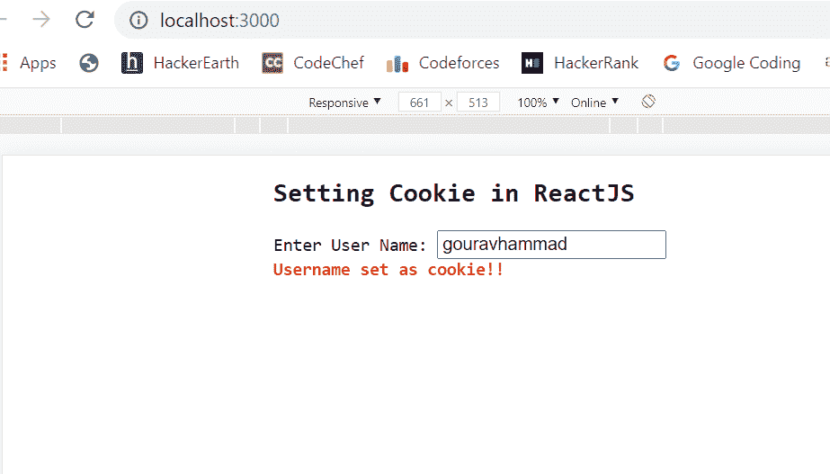
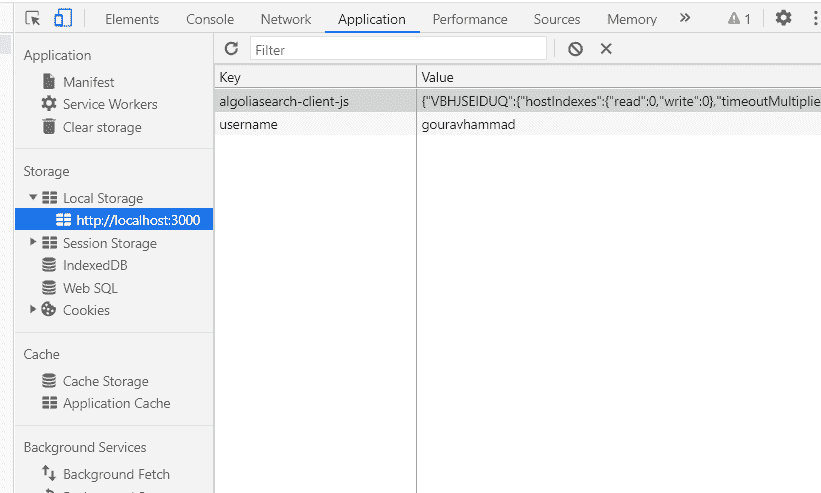

# 如何在 ReactJS 中设置 Cookie？

> 原文:[https://www.geeksforgeeks.org/how-to-set-cookie-in-reactjs/](https://www.geeksforgeeks.org/how-to-set-cookie-in-reactjs/)

cookie 是应用程序的重要组成部分，因为 cookie 用于以键值形式设置值，该键值可以在浏览器存储中设置，并进一步用于识别当前用户。下面的例子展示了如何在 ReactJS 应用程序中设置 cookie，这里我们将用户名作为密钥，它是用它的值在 cookie 中设置的。

**创建反应应用程序:**

**步骤 1:** 使用以下命令创建一个反应应用程序:

```jsx
npx create-react-app setcookiedemo
```

**步骤 2:** 创建项目文件夹(即 **setcookiedemo)后，**使用以下命令移动到该文件夹:

```jsx
cd setcookiedemo
```

**项目结构:**如下图。


项目结构

**App.js:** 现在在 **App.js** 文件中写下以下代码。在这里，应用程序是我们的默认组件，我们已经编写了代码来使用基本的用户界面在本地存储中设置 cookies。

## java 描述语言

```jsx
import React, { useState } from "react";

const App = () => {

  const [message, setMessage] = useState('')

  const setCookieFunction = (value) => {

    localStorage.setItem('username', value)

    setMessage('Username set as cookie!!')
  }

  return (
    <div style={{
      marginLeft: '200px',
    }}>
      <pre>
        <h2>Setting Cookie in ReactJS</h2>
        <span>Enter User Name: </span><input type="text" 
        onChange={(e) => setCookieFunction(e.target.value)}></input> <br />
        <span style={{
          fontWeight: 'bold',
          color: 'red',
        }}>{message}</span>
      </pre>
    </div>
  );
}

export default App
```

**运行应用程序的步骤:**从项目的根目录使用以下命令运行应用程序:

```jsx
npm start
```

**输出:**

1.  如果用户输入的用户名被设置为 cookie，输出如下:

    

2.  现在进入浏览器的 **localStorage** 通过查看浏览器页面，可以看到我们的 cookie，设置为 key='username '，value='gouravhammad '，如下图所示:

    