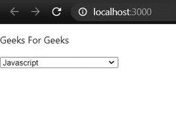
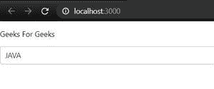

# 如何使用 ReactJS 设置 select 中的默认值？

> 原文:[https://www . geeksforgeeks . org/如何使用-reactjs/](https://www.geeksforgeeks.org/how-to-set-default-value-in-select-using-reactjs/) 在选择中设置默认值

在 HTML 中，选项标签中的“**选中的“**属性用于设置选择菜单中的默认值。如果我们没有使用**反应选择组件，同样的方法也可以用于反应设置默认值。**但是，如果您正在使用*反应-选择*，那么您需要遵循不同的方法，如下所述。

**以下是使用 ReactJS 设置选择默认值的两种方法:**

**方法 1:不使用反应选择组件**

您可以将布尔选择的属性与需要将其值设置为默认值的选项一起使用。如果没有选项与此属性集成，默认情况下会选择第一个选项。你可以在[这篇文章](https://www.geeksforgeeks.org/how-to-set-the-default-value-for-an-html-select-element/)中读到更多关于这个方法的内容。

**语法:**

```jsx
<option value='value' selected> label </option>
```

**示例:**现在在 **App.js** 文件中写下以下代码。在这里，App 是我们编写代码的默认组件。

## App.js

```jsx
import { Component } from 'react'

class App extends Component {
  constructor(props) {
    super(props)
  }

  render() {
    return (
      <div>
        <p>Geeks For Geeks</p>

        <form>
          <select name='languages'
                  style={{ width: '200px' }}>
            <option value='JAVA'>
              JAVA
            </option>
            <option value='C++'>
              C++
            </option>
            <option value='Javascript' selected>
              Javascript
            </option>
            <option value='Python'>
              Python
            </option>
            <option value='R'>
              R
            </option>
            <option value='Scala'>
              Scala
            </option>
            <option value='Swift'>
              Swift
            </option>
          </select>
        </form>
      </div>
    );
  }
}

export default App;
```

**输出:**



在本地服务器上执行代码时的输出

**方法 2:** **使用反应选择组件**

您可以使用属性*默认值*在选择菜单中设置默认值。如果没有选项与该属性集成，默认情况下会选择第一个选项。您可以创建一个对象数组，在其中存储要显示的所有选项，并且任何单个对象都在*默认值*属性中传递。

**语法:**

```jsx
<Select
    option={optionArray}
    defaultValue={optionArray[index]}
/>
```

**注意:**确保您已经安装了***react-使用以下命令选择*** 模块。

```jsx
npm install react-select
```

**示例:**现在在 **App.js** 文件中写下以下代码。在这里，App 是我们编写代码的默认组件。

## App.js

```jsx
import { Component } from 'react'
import Select from 'react-select';

const options = [
  { value: 'C++', label: 'C++' },
  { value: 'JAVA', label: 'JAVA' },
  { value: 'Javascript', label: 'Javascript' },
  { value: 'Python', label: 'Python' },
  { value: 'Swift', label: 'Swift' }
];

class App extends Component {
  constructor(props) {
    super(props)
  }

  render() {
    return (
      <div>
        <p>Geeks For Geeks</p>

        <Select
          value={options.value}
          options={options}
          defaultValue={options[1]}
        />
      </div>
    );
  }
}

export default App;
```

**输出:**



在本地服务器上执行代码时的输出