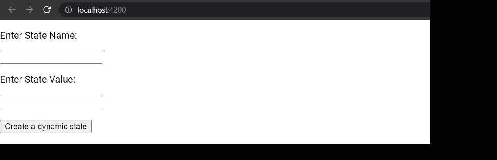

# 如何在 ReactJS 中用动态键名设置状态？

> 原文:[https://www . geeksforgeeks . org/如何使用动态键名设置状态-in-reactjs/](https://www.geeksforgeeks.org/how-to-set-state-with-a-dynamic-key-name-in-reactjs/)

[React.js](https://www.geeksforgeeks.org/react-js-introduction-working/) 引入了状态的概念。状态用于存储特定组件的数据。使用 setState 函数可以相应地更新这些状态。状态的更新导致用户界面的重新呈现。您可以为状态指定有意义的名称。可能需要用动态密钥名创建一个状态。我们可以在“反应”中这样做。

让我们创建一个 React 项目，然后我们将创建一个具有动态键名的状态。

**创建反应项目:**

**步骤 1:** 在终端中键入以下命令，创建一个 react 应用程序。

```
npx create-react-app project_name
```

**第二步**:现在运行以下命令，进入项目文件夹即 project_name。

```
cd project_name
```

**项目结构:**如下图:


项目结构

**示例:**让我们创建一个输入字段，将状态名称作为输入，状态值作为另一个输入。现在添加了一个具有 onclick 功能的按钮。当用户单击时，它用动态键名在“[ ]”内封闭值来创建状态。用户可以点击按钮创建一个新的状态，它将在用户界面中显示新创建的状态。

**文件名:App.js**

## java 描述语言

```
import React, { Component } from "react";

class App extends Component {
  constructor() {
    super();
    this.state = {
      name: "",
      value: " ",
    };
  }

  render() {
    return (
      <div>
        <p>Enter State Name:</p>
        <input
          onChange={(e) => {
            this.setState({ name: e.target.value });
          }}
          type="text"
        ></input>
        <p>Enter State Value:</p>
        <input
          onChange={(e) => {
            this.setState({ value: e.target.value });
          }}
          type="text"
        ></input>
        <br />
        <br />
        <button
          onClick={() => {
            this.setState({
              [this.state.name]: this.state.value,
            });
          }}
        >
          Create a dynamic state
        </button>
        {this.state[this.state.name] ? (
          <p>
            {this.state.name}:{this.state[this.state.name]}
          </p>
        ) : null}
      </div>
    );
  }
}

export default App;
```

**运行应用程序的步骤:**从项目的根目录使用以下命令运行应用程序:

```
npm start
```

**输出:**打开浏览器。默认情况下，它会打开一个运行 localhost 的选项卡，您可以看到图像中显示的输出。填写所需的详细信息并点击按钮。正如您在输出中看到的，使用您输入的值创建了具有动态名称的新状态。用户界面检查状态是否存在，然后显示值。

