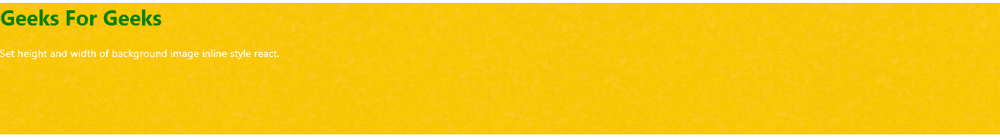
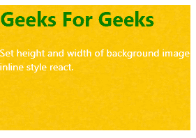

# 如何在 react 中设置背景图像内嵌样式的高度和宽度？

> 原文:[https://www . geesforgeks . org/如何设置背景图像的高度和宽度-内嵌样式-in-react/](https://www.geeksforgeeks.org/how-to-set-the-height-and-width-of-background-image-inline-style-in-react/)

在 React 中，可以创建一个带有样式信息(如背景图像、高度、宽度等)的对象，并在 HTML 元素的样式属性中引用该对象。因为内联 CSS 是用 JavaScript 对象编写的，所以具有两个名称的属性，比如背景色，必须用 camel case 语法编写。

**语法:**

```
class MyHeader extends React.Component {
  render() {
    const mystyle = {
      backgroundColor: "white",
     // CSS CODE
     };
    return (
      <div>
      <h1 style={mystyle}>Hello Style!</h1>
      // All styling define in mystyle 
      // object will applied to h1 element.
      </div>
    );
  }
}

```

**示例 1:** 将 div 元素中背景图像的宽度和高度设置为 100%和 200px。

## java 描述语言

```
import React from 'react';
import './App.css';

function App() {
  const myStyle={
    backgroundImage:"url(" +
"https://i.pinimg.com/474x/62/69/be/6269be179ab7d610b2a4959387fd77af.jpg"+")",
    width:'100%',
    height:'200px',
    };
  return (
    <div style={myStyle}>
     <h1 style={{color:'green'}}> 
       Geeks For Geeks 
     </h1>
     <p style={{color:'white'}}> 
       Set height and width of background
       image inline style react. 
     </p>

    </div>
  );
}
export default App;
```

**输出:**这里，myStyle 对象中定义的所有样式都适用于 div 元素。可以检查 div 元素中背景图像的宽度和高度是 100%和 200px。



**示例 2:** 将 div 元素中背景图像的宽度和高度设置为 20%和 200px。

## java 描述语言

```
import React from 'react';
import './App.css';

function App() {
  const myStyle={
    backgroundImage:"url(" +
    "https://i.pinimg.com/474x/62/69/be/6269be179ab7d610b2a4959387fd77af.jpg"+")",
    width:'20%',
    height:'200px',
    };
  return (
    <div style={myStyle}>
     <h1 style={{color:'green'}}> 
       Geeks For Geeks 
     </h1>
     <p style={{color:'white'}}> 
       Set height and width of background image
       inline style react. 
    </p>

    </div>
  );
}
export default App;
```

**输出:**这里，myStyle 对象中定义的所有样式都适用于 div 元素。可以检查 div 元素中背景图像的宽度和高度是 20%和 200px。



**注意:**同样，可以在一个对象中定义许多其他 CSS 样式，并在相应 HTML 元素的样式属性中调用该对象。对象中定义的所有 CSS 样式都将应用于特定的 HTML 元素，如上例所示。