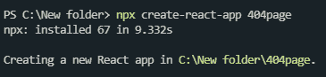
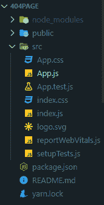
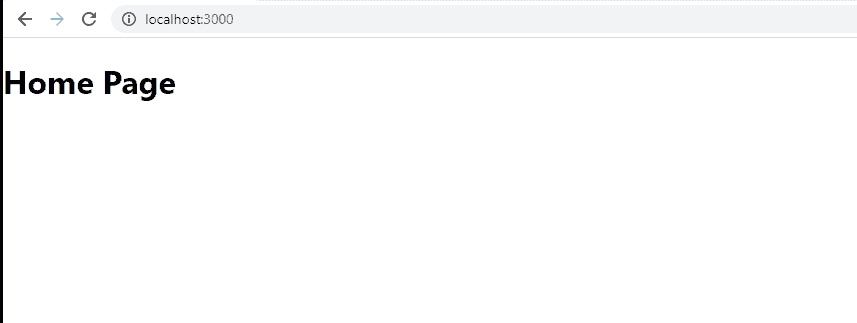

# 如何在反应路由中设置 404 页？

> 原文:[https://www . geesforgeks . org/how-setup-404-page-in-react-routing/](https://www.geeksforgeeks.org/how-to-setup-404-page-in-react-routing/)

每个网站都需要一个 404 页，如果网址不存在或网址可能已被更改。要在角度布线中设置 404 页面，我们必须首先创建一个组件，以便在发生 404 错误时显示。在下面的方法中，我们将创建一个名为 PagenotfoundComponent 的简单反应组件。

**创建反应应用程序并安装模块:**

**步骤 1:** 使用以下命令创建一个反应应用程序:

```jsx
npx create-react-app 404page
```

注意:如果您之前已经通过 npm 全局安装了 create-react-app，请直接使用下面的命令:



您的开发环境已经准备好了。现在让我们在应用程序中安装反应路由器。

**步骤 2:** 创建项目文件夹(即样式)后，移动到相同的文件夹:

```jsx
cd styled
```

**第三步:**安装 react-router-DOM:React-router-DOM 可以在你的 React 应用中通过 npm 安装。按照下面给出的步骤在您的 react 应用程序中安装 react-router-dom:要安装 react-router-dom，请使用以下命令:

```jsx
 npm install --save react-router-dom
```

**项目结构:**如下图。



项目结构

**第 4 步:**现在在 App.js 文件中写下以下代码。在这里，App 是我们编写代码的默认组件。

**App.js**

## java 描述语言

```jsx
import React from "react";
import {  Route, Switch, BrowserRouter } 
        from 'react-router-dom'
import Home from '.Home';
import PageNotFound from './404Page';

function App() {
  return (
    <BrowserRouter>
      <Switch>
        <Route exact path='/' component={Home} />
        <Route path="*" component={PageNotFound} />
      </Switch>
    </BrowserRouter>
  );
}

export default App;
```

**Home.js**

## java 描述语言

```jsx
import React from 'react';

const Home = () => {
    <div>
        <h1>Home Page</h1>
    </div>
}

export default Home;
```

**PageNotFound.js**

## java 描述语言

```jsx
import React from 'react';

const PageNotFound= () =>{
    <div>
        <h1>404 Error</h1>
        <h1>Page Not Found</h1>
    </div>
}

export default PageNotFound;
```

**说明:**此处页面未找到的路由在路由内部提供。这里，除了提供的路线之外的任何路径都由这个页面处理，我们的 HTML 模板显示在浏览器中。所以现在，如果有人试图向路由数组中不存在的任何页面发送请求，那么该用户会自动导航到这个页面。

**运行应用程序的步骤:**运行以下命令启动应用程序:

```jsx
npm start
```

**输出:**现在打开浏览器，转到 **http://localhost:3000** ，一切正常。现在转到**http://localhost:3000/any**，我们会得到如下所示的 404 错误。

