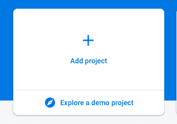
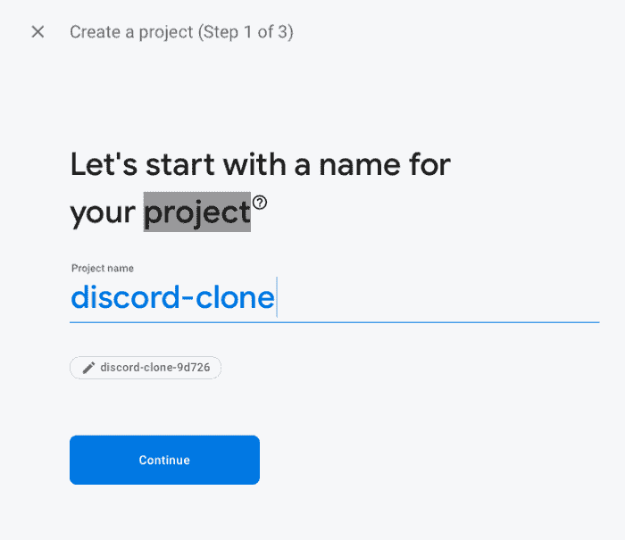
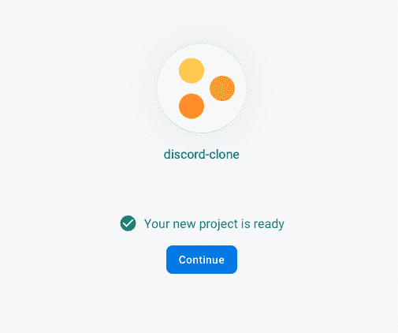
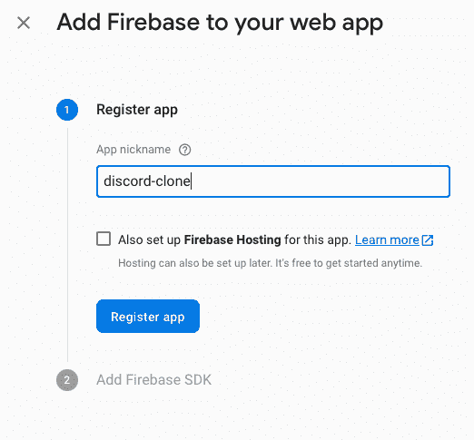
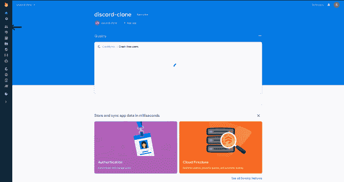

# 如何为你的反应项目设置一个火基地？

> 原文:[https://www . geeksforgeeks . org/如何为您的反应项目设置一个火基/](https://www.geeksforgeeks.org/how-to-setup-a-firebase-for-your-react-project/)

为了为您的项目设置一个 firebase，只需遵循以下简单的步骤:

**1。**前往[console.firebase.google.com](console.firebase.google.com.)

**2** 。点击**添加项目**按钮，如果你是新用户，可能会说**新建项目**之类的。现有用户的情况如下所示:

**3** 。点击后，输入**不和谐-克隆**作为项目名称。

**4** 。对于下一步，如果您愿意，您可以启用谷歌分析，但是这不是必需的。

**5** 。之后，你已经选择了你的选择，Firebase 将开始为你创建项目。一旦完成，它应该如下所示:

**6** 。一旦你得到这个，你可以点击**继续**。Firebase 将带您返回到项目屏幕，然后单击下图中指向的按钮(< / >):

**7** 。你会被要求为网络应用程序命名，你可以放任何你喜欢的东西。然而，我们在这个例子中使用了**不和谐克隆**。输入名称后，单击**注册应用程序**按钮。

**8** 。它会要求你添加你的 Firebase SDK，但现在你只需点击蓝色按钮，然后继续。

**9** 。转到边栏上的身份验证选项卡并点击它。

**10** 。然后点击**登录方式**选项卡，选择**谷歌**，然后切换**启用**。完成后，点击**保存**按钮。

11.现在您已经设置了身份验证，单击身份验证徽标下方的 **Firestore** 徽标。完成后，点击**创建数据库**按钮。然后选择**在测试模式下启动**选项，然后点击**下一步**和，之后点击**启用**按钮。

完成以上步骤后，就可以为您的项目设置 firebase 了。