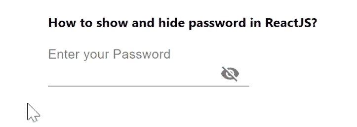

# 如何在 ReactJS 中显示和隐藏密码？

> 原文:[https://www . geeksforgeeks . org/如何在 reactjs 中显示和隐藏密码/](https://www.geeksforgeeks.org/how-to-show-and-hide-password-in-reactjs/)

可以通过添加眼睛图标的特征向用户显示密码，以便用户可以看到密码。React 的 Material UI 有这个组件可供我们使用，非常容易集成。我们可以使用以下方法在反应堆中使用一些核心材料组件。

**创建反应应用程序并安装模块:**

**步骤 1:** 使用以下命令创建一个反应应用程序:

```jsx
npx create-react-app foldername
```

**步骤 2:** 在创建项目文件夹(即文件夹名**)后，使用以下命令将**移动到该文件夹:

```jsx
cd foldername
```

**步骤 3:** 创建 ReactJS 应用程序后，使用以下命令安装 **material-ui** 模块:

```jsx
npm install @material-ui/core
npm install @material-ui/icons
```

**项目结构:**如下图。


项目结构

**App.js:** 现在在 **App.js** 文件中写下以下代码。在这里，App 是我们编写代码的默认组件。

## java 描述语言

```jsx
import React from "react";
import IconButton from "@material-ui/core/IconButton";
import InputLabel from "@material-ui/core/InputLabel";
import Visibility from "@material-ui/icons/Visibility";
import InputAdornment from "@material-ui/core/InputAdornment";
import VisibilityOff from "@material-ui/icons/VisibilityOff";
import Input from "@material-ui/core/Input";

const App = () => {
  const [values, setValues] = React.useState({
    password: "",
    showPassword: false,
  });

  const handleClickShowPassword = () => {
    setValues({ ...values, showPassword: !values.showPassword });
  };

  const handleMouseDownPassword = (event) => {
    event.preventDefault();
  };

  const handlePasswordChange = (prop) => (event) => {
    setValues({ ...values, [prop]: event.target.value });
  };

  return (
    <div
      style={{
        marginLeft: "30%",
      }}
    >
      <h4>How to show and hide password in ReactJS?</h4>
      <InputLabel htmlFor="standard-adornment-password">
        Enter your Password
      </InputLabel>
      <Input
        type={values.showPassword ? "text" : "password"}
        onChange={handlePasswordChange("password")}
        value={values.password}
        endAdornment={
          <InputAdornment position="end">
            <IconButton
              onClick={handleClickShowPassword}
              onMouseDown={handleMouseDownPassword}
            >
              {values.showPassword ? <Visibility /> : <VisibilityOff />}
            </IconButton>
          </InputAdornment>
        }
      />
    </div>
  );
};

export default App;
```

**运行应用程序的步骤:**从项目的根目录使用以下命令运行应用程序。

```jsx
npm start
```

**输出:**现在打开浏览器，转到***http://localhost:3000/***，会看到如下输出。

