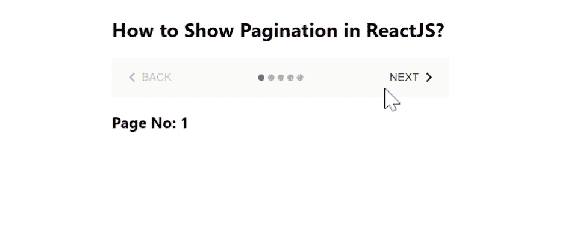

# 如何在 ReactJS 中显示分页？

> 原文:[https://www . geeksforgeeks . org/how-show-paging-in-reactjs/](https://www.geeksforgeeks.org/how-to-show-pagination-in-reactjs/)

分页基本上就是显示页码，让用户通过【下一页】和【上一页】按钮，轻松在  页面之间切换  。【React 的 Material UI 有这个组件可供我们使用，非常容易集成。我们可以使用以下方法在 ReactJS 中创建分页逻辑。

**创建反应应用程序并安装模块:**

**步骤 1:** 使用以下命令创建一个反应应用程序:

```jsx
npx create-react-app foldername
```

**步骤 2:** 创建项目文件夹(即文件夹名**)后，使用以下命令移动到该文件夹中:**

```jsx
cd foldername
```

**步骤 3:** 创建 ReactJS 应用程序后，使用以下命令安装 **material-ui** 模块:

```jsx
npm install @material-ui/core
npm install @material-ui/icons
```

**项目结构:**如下图。


项目结构

**App.js:** 现在在 **App.js** 文件中写下以下代码。在这里，App 是我们编写代码的默认组件。

## java 描述语言

```jsx
import React from "react";
import Button from "@material-ui/core/Button";
import { useTheme } from "@material-ui/core/styles";
import KeyboardArrowRight from "@material-ui/icons/KeyboardArrowRight";
import KeyboardArrowLeft from "@material-ui/icons/KeyboardArrowLeft";
import MobileStepper from "@material-ui/core/MobileStepper";

const App = () => {
  const theme = useTheme();

  const forwardButton = () => {
    setActiveStep((prevActiveStep) => prevActiveStep - 1);
  };

  const [INDEX, setActiveStep] = React.useState(0);

  const previousButton = () => {
    setActiveStep((prevActiveStep) => prevActiveStep + 1);
  };

  return (
    <div
      style={{
        marginLeft: "40%",
      }}
    >
      <h2>How to Show Pagination in ReactJS?</h2>
      <MobileStepper
        steps={5}
        variant="dots"
        style={{
          flexGrow: 1,
          maxWidth: 400,
        }}
        activeStep={INDEX}
        position="static"
        nextButton={
          <Button size="small" 
                  onClick={previousButton} 
                  disabled={INDEX === 4}>
            Next
            {theme.direction !== "rtl" ? (
              <KeyboardArrowRight />
            ) : (
              <KeyboardArrowLeft />
            )}
          </Button>
        }
        backButton={
          <Button size="small" 
                  onClick={forwardButton} 
                  disabled={INDEX === 0}>
            {theme.direction !== "rtl" ? (
              <KeyboardArrowLeft />
            ) : (
              <KeyboardArrowRight />
            )}
            Back
          </Button>
        }
      />
      <h3>Page No: {INDEX + 1}</h3>
    </div>
  );
};

export default App;
```

**运行应用程序的步骤:**从项目的根目录使用以下命令运行应用程序:

```jsx
npm start
```

**输出:**现在打开浏览器，转到***http://localhost:3000/***，会看到如下输出。

