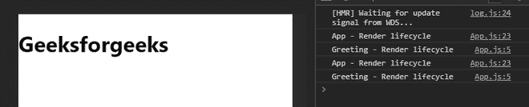
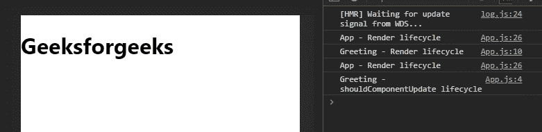

# 如何解决 ReactJS 中过多的重渲染错误？

> 原文:[https://www . geeksforgeeks . org/如何解决过多重渲染错误-in-reactjs/](https://www.geeksforgeeks.org/how-to-solve-too-many-re-renders-error-in-reactjs/)

“重新呈现器太多”是一个 React 错误，发生在您到达无限呈现循环之后，通常是由 useEffect 钩子中的代码或组件本身的主体无条件调用状态设置器引起的。

【React 什么时候决定重新渲染一个组件？

*   第一次渲染将在组件安装生命周期之后触发。
*   在反应组件将更新生命周期之后，它将被激活。
*   在安装了一个反应组件后，它将会监听任何已经改变的反应道具或状态。
*   默认情况下，当它检测到某些东西发生变化时，它会重新呈现整个 React 组件及其子组件。

**以下是避免 React 中过多重渲染错误的一些技巧:**

*   不要改变组件主体中的状态。
*   非常谨慎地使用 useEffect 钩子。useEffect 的第二个参数是基于 useEffect 将调用的状态数组。所以不要在 useEffect 中更新这些状态，否则它会一次又一次地重新显示组件。
*   **使用 React should component update:**React should component update 是一种优化性能的方法，它告诉 React 停止重新呈现组件，即使它可能已经更改了状态或属性值。仅当零件在使用时保持不变或纯净时，才使用这种方法。您应该使用“反应应该组件更新”方法返回一个布尔值。如果需要重新渲染，则返回 true 如果需要避免重新渲染，则返回 false。

**创建反应应用程序:**

**步骤 1:** 使用以下命令创建一个反应应用程序:

```
npx create-react-app foldername
```

**步骤 2:** 创建项目文件夹(即文件夹名)后，使用以下命令移动到该文件夹:

```
cd foldername
```

**项目结构:**如下图。


**Filename- App.js:** 下面是一个如何使用 React shouldComponentUpdate 的例子。在这段代码中，我构建了 React 的两个组件。一个是问候语的一部分，另一个是 app 组件。在渲染生命周期中，每个 React 组件都是一个记录消息的控制台。

## java 描述语言

```
import React from "react";
class Greeting extends React.Component {
  render() {
    console.log("Greeting - Render lifecycle");

    return <h1>Geeksforgeeks</h1>;
  }
}

class App extends React.Component {
  render() {
    console.log("App - Render lifecycle");

    return <Greeting />;
  }
}

export default App;
```

**输出:**


**Filename- App.js:** 接下来，在 componentDidMount React 生命周期中，我将添加 React 状态，并更新状态值。

## java 描述语言

```
import React from "react";

class Greeting extends React.Component {
  render() {
    console.log("Greeting - Render lifecycle");

    return <h1>Geeksforgeeks</h1>;
  }
}

class App extends React.Component {
  state = {
    greeted: false,
  };

  componentDidMount() {
    this.setState({ greeted: true });
  }

  render() {
    console.log("App - Render lifecycle");

    return <Greeting />;
  }
}

export default App;
```

**输出:**在输出中可以看到渲染生命周期在 app 和问候语组件上都被触发了不止一次。这是因为在更新状态值之后，React 应用程序组件被重新呈现，并且其子组件也被重新呈现。我们应该假设问候部分是不变的，并且永远不会改变。



**Filename- App.js:** 当我们正在创建的组件在任何时候都是静态的时，请使用 shouldComponentUpdate 钩子。

## java 描述语言

```
import React from "react";
class Greeting extends React.Component {
  shouldComponentUpdate() {
    console.log("Greeting - shouldComponentUpdate lifecycle");

    return false;
  }

  render() {
    console.log("Greeting - Render lifecycle");

    return <h1>Geeksforgeeks</h1>;
  }
}

class App extends React.Component {
  state = {
    greeted: false,
  };

  componentDidMount() {
    this.setState({ greeted: true });
  }

  render() {
    console.log("App - Render lifecycle");

    return <Greeting />;
  }
}

export default App;
```

**输出:**可以看到 app 和问候语组件经历了一轮渲染生命周期。更改状态值后，应用程序组件再次经历渲染生命周期。但是问候组件没有控制台记录生命周期渲染消息。

