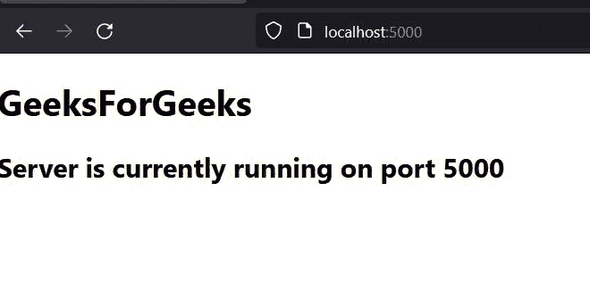
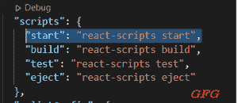
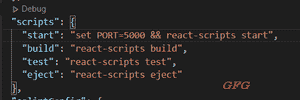
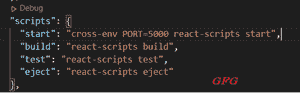

# 如何指定运行基于 create-react-app 项目的端口？

> 原文:[https://www . geeksforgeeks . org/如何指定端口-运行-创建-反应-基于应用程序-项目/](https://www.geeksforgeeks.org/how-to-specify-a-port-to-run-a-create-react-app-based-project/)

当我们使用[*npx create-react-app*](https://www.geeksforgeeks.org/reactjs-setting-development-environment/)命令创建一个新的 react app 时，该 app 的默认端口为 3000。我们可以从*本地主机:3000* 访问该应用。

在某些情况下，用户需要在他们的计算机上同时运行 2 个或更多的 react 应用程序，但是 2 个 react 应用程序不能在同一个端口上运行。因此，用户需要更改其中一个 react 应用程序的默认端口。

**创建反应应用程序:**

*   **步骤 1:** 创建一个新的 react 应用程序，运行下面的命令到您的终端。

```jsx
npx create-react-app testapp
```

*   **第二步:**通过对终端运行下面的命令，移动到项目目录。

```jsx
cd testapp
```

**项目结构:**会是这样的。


**实现:**有几种方法可以改变 react app 的默认端口。在本教程中，我们将逐一介绍每种方法。

**注意:**以下是根文件即 App.js 的代码 all 方法的常见用法，输出也在下面给出。

**示例:**在 App.js 文件中，我们会添加一些基本的 HTML 代码在网页上进行渲染。

## App.js

```jsx
import React, { Component } from "react";

class App extends Component {
  render() {
    return (
      <div>
        <h1>GeeksForGeeks</h1>
        <h2>Server is currently running on port 5000</h2>
      </div>
    );
  }
}

export default App;
```

**输出:**



**方法 1:创建一个** **环境变量**

这是更改 react app 默认端口的最简单方法。我们需要创建 ***。env*** 文件内的项目目录并添加环境变量。用户需要在*内添加以下代码。env* 文件。

```jsx
PORT=<specify_port_of_your_choice> 
```

**示例:**

```jsx
PORT=5000
```

现在，使用 *npm start* 命令运行项目，react app 将自动开始在您选择的端口上运行。

**方法二:编辑 package.json 文件**

在这个方法中，我们必须在 package.json 文件中编辑一行代码。在这里，用户会在“*脚本*对象*中找到类似*“开始”:“反应-脚本开始”*的代码。*在下图中，可以看到“*脚本”*对象的默认视图。



用户需要编辑“*脚本”*对象的第一行，他们必须在那里添加下面的代码。

```jsx
"start": "set PORT=<specify_port_of_your_choice> && react-scripts start"
```

**示例:**

```jsx
"start": "set PORT=5000 && react-scripts start"
```

编辑 package.json 文件后，您的“*脚本”*对象应该如下图所示。



**方法 3:安装并添加跨环境包**

首先，我们需要在项目目录中安装“*cross-env”*包。因此，打开终端并在项目目录中运行下面的命令。

```jsx
yarn add -D cross-env
```

安装完跨 env 包后，用户需要编辑 *package.json* 文件内“scripts”对象的第一行。用户需要通过删除“脚本”对象中的第一行来更改下面的代码。

```jsx
"start": "cross-env PORT=<specify_port_of_your_choice> react-scripts start"
```

**示例:**

```jsx
"start": "cross-env PORT=5000 react-scripts start"
```

在代码内部进行更改后，您的“脚本”对象应该如下图所示。



**方法 4:用运行命令**指定端口

在这种方法中，我们不需要在 react 应用程序中编辑任何文件。我们只需要提到带有 react 项目的 run 命令的端口。用户必须使用下面的命令来运行项目，而不是 *npm 启动。*

```jsx
PORT=<specify_port_of_your_choice> npm start
```

**示例:**

```jsx
PORT=5000 npm start
```

当用户使用上述命令运行 react 项目时，它将在用户选择的端口上启动。