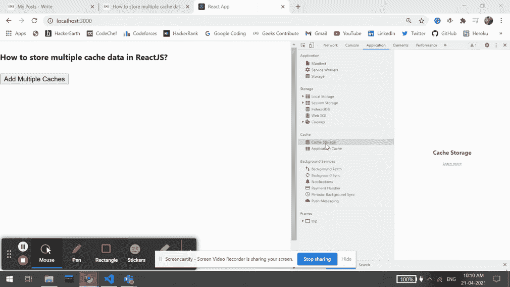

# 如何在 ReactJS 中存储多个缓存数据？

> 原文:[https://www . geeksforgeeks . org/how-store-multi-cache-in-data-reactjs/](https://www.geeksforgeeks.org/how-to-store-multiple-cache-data-in-reactjs/)

我们可以在 ReactJS 中使用以下方法在 [ReactJS](https://www.geeksforgeeks.org/reactjs-tutorials/) 中存储多个缓存数据。我们可以将多个缓存数据存储到浏览器中，并在需要时在我们的应用程序中使用它。缓存是一种技术帮助我们将给定资源的副本存储到我们的浏览器中，并在请求时提供给我们。

**方法:**按照这些简单的步骤以便在 ReactJS 中存储多个缓存数据。我们已经创建了 *addMultipleCacheData* 函数，该函数获取用户数据列表并存储到浏览器缓存中。当我们点击按钮时，该功能被触发，数据被存储到缓存中，我们会看到一个警告弹出窗口。在下面的示例中，我们试图使用我们定义的函数存储多个名为缓存一、缓存二和缓存三的缓存。

**创建反应应用程序:**

*   **步骤 1:** 使用以下命令创建一个反应应用程序:

    ```jsx
    npx create-react-app foldername
    ```

*   **步骤 2:** 创建项目文件夹后，即文件夹名称**，**使用以下命令移动到项目文件夹:

    ```jsx
    cd foldername
    ```

**项目结构:**如下图。


项目结构

**示例:**现在在 **App.js** 文件中写下以下代码。在这里，App 是我们编写代码的默认组件。

## App.js

```jsx
import * as React from 'react';

export default function App() {

  // Function to add our give multiple cache data
  const addMultipleCacheData = async (cacheList) => {

    for (var i = 0; i < cacheList.length; i++) {
      // Coverting our respons into Actual Response form
      const data = new Response(JSON.stringify(cacheList[i].cacheData));

      if ('caches' in window) {
        // Opening given cache and putting our data into it
        var cache = await caches.open(cacheList[i].cacheName)
        cache.put(cacheList[i].url, data);
      }
    }
    alert('Multiple Cache Stored!')
  };

  const CacheToBeStored = [
    { cacheName: 'CacheOne', cacheData: '1 CacheData', 
    url: 'https://localhost:300' },
    { cacheName: 'CacheTwo', cacheData: '2 CacheData', 
    url: 'https://localhost:300' },
    { cacheName: 'CacheThree', cacheData: '3rd CacheData', 
    url: 'https://localhost:300' },
  ]

  return (
    <div style={{ height: 500, width: '80%' }}>
      <h4>How to store multiple cache data in ReactJS?</h4>
      <button onClick={() => addMultipleCacheData(CacheToBeStored)} >
        Add Multiple Caches</button>
    </div>
  );
}
```

**运行应用程序的步骤:**从项目的根目录使用以下命令运行应用程序:

```jsx
npm start
```

**输出:**现在打开浏览器，转到***http://localhost:3000/***，会看到如下输出:

