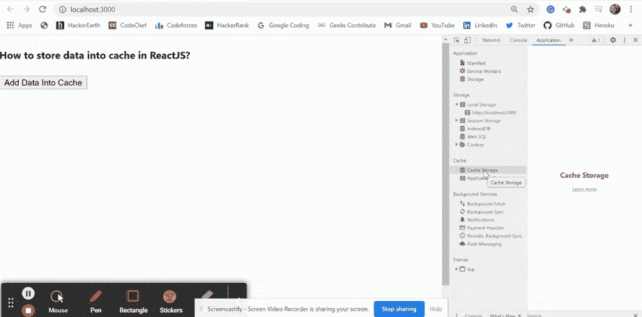

# 如何在 ReactJS 中存储单缓存数据？

> 原文:[https://www . geeksforgeeks . org/如何存储单缓存数据 in-reactjs/](https://www.geeksforgeeks.org/how-to-store-single-cache-data-in-reactjs/)

我们可以在 reatjs 中使用以下方法将单个数据存储到 reatjs 的缓存中。我们可以将一些数据缓存到浏览器中，并在需要时在我们的应用程序中使用它。缓存是一种技术，它帮助我们将给定资源的副本存储到浏览器中，并在请求时提供给用户。

**方法:**按照这些简单的步骤将单个数据存储到 ReactJS 中的缓存中。我们已经创建了*添加数据到缓存*功能，该功能获取用户数据并存储到浏览器缓存中。当我们点击按钮时，该功能被触发，数据被存储到缓存中，我们会看到一个警告弹出窗口。

**创建反应应用程序:**

**步骤 1:** 使用以下命令创建一个反应应用程序:

```
npx create-react-app foldername
```

**步骤 2:** 创建项目文件夹后，即文件夹名称**，**使用以下命令移动到项目文件夹:

```
cd foldername
```

**项目结构:**如下图。


项目结构

**示例:**现在在 **App.js** 文件中写下以下代码。在这里，App 是我们编写代码的默认组件。

## App.js

```
import * as React from 'react';

export default function App() {

  // Function to add our give data into cache
  const addDataIntoCache = (cacheName, url, response) => {
    // Converting our respons into Actual Response form
    const data = new Response(JSON.stringify(response));

    if ('caches' in window) {
      // Opening given cache and putting our data into it
      caches.open(cacheName).then((cache) => {
        cache.put(url, data);
        alert('Data Added into cache!')
      });
    }
  };

  return (
    <div style={{ height: 500, width: '80%' }}>
      <h4>How to store data into cache in ReactJS?</h4>
      <button onClick={()=>addDataIntoCache('MyCache',
      'https://localhost:300','SampleData')} >
        Add Data Into Cache</button>
    </div>
  );
}
```

**运行应用程序的步骤:**从项目的根目录使用以下命令运行应用程序:

```
npm start
```

**输出:**现在打开浏览器，转到***http://localhost:3000/***，会看到如下输出:

