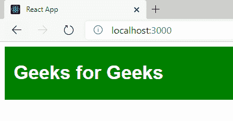

# 如何在 React 中用 SASS/SCSS 风格？

> 原文:[https://www . geesforgeks . org/how-style-with-sass-scss-in-react/](https://www.geeksforgeeks.org/how-to-style-with-sass-scss-in-react/)

**简介:**我们可以在 React 中使用 **SASS** 使用一个名为 ***的包节点-sass** 。*使用*节点-sass* 我们只需创建 *sass* 文件，并将其用作我们的 React 应用程序中的正常 CSS 文件，*节点-sass* 将负责编译 *sass* 文件。

**先决条件:**[SASS 简介](https://www.geeksforgeeks.org/sass-introduction/)

**模块:**要编译 sass 代码，可以使用**节点-sass** 。

**设置环境和执行:**

**步骤 1:** 创建反应应用程序命令

```
npx create-react-app foldername
```

**步骤 2:** 创建项目文件夹，即文件夹名称后，使用以下命令移动到该文件夹:

```
cd foldername
```

**项目结构:**如下图。


**步骤 3:** 使用以下命令安装所需模块:

```
npm install node-sass
```


**步骤 4:** 创建一个如下所示的 sass 文件:


**第 5 步:**下面是 sass 语法中的代码。

**filename-app . SCS:**

## 半铸钢ˌ钢性铸铁(Cast Semi-Steel)

```
.gfg {
  background-color: green;
  padding: 5px;
  padding-left: 15px;

  h1 {
    color: white;
    font-family: sans-serif;
  }
}
```

**第六步:**下面是 App.js 文件中的代码。

**文件名:App.js**

## java 描述语言

```
import React, { Component }  from 'react';

import './App.scss';

class App extends Component {

  render() {
    return (
      <div className="gfg">
        <h1>Geeks for Geeks</h1>
      </div>
    );
  }

}

export default App;
```

**运行应用程序的步骤:**从项目的根目录使用以下命令运行应用程序:

```
npm start
```

**注:** *如有编译问题降级节点-sass 如下:*

```
npm install node-sass@4.14.1
```

**输出:**现在打开浏览器，转到***http://localhost:3000/***，会看到如下输出:

