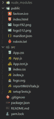
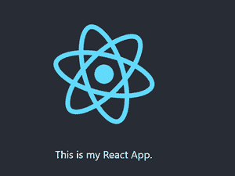
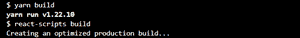
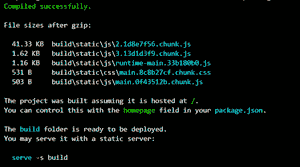
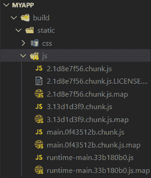
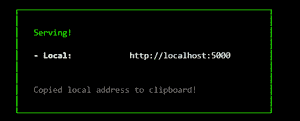
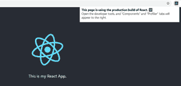
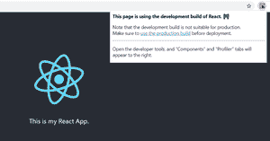

# 如何告诉 ReactJS 在生产模式下建设项目？

> 原文:[https://www . geesforgeks . org/how-to-tell-reactjs-to-build-project-in-production-mode/](https://www.geeksforgeeks.org/how-to-tell-reactjs-to-build-project-in-production-mode/)

在开发模式中，React 包含许多警告，有助于在问题导致 bug 之前发现问题。这样做，会增加捆绑包的大小，并使应用程序运行速度变慢。在本地开发应用程序时，这种放缓可能是可以接受的，但我们在部署时负担不起。

在开发模式中，React 在内部使用了几种巧妙的技术来最小化更新用户界面所需的昂贵的 DOM 操作的数量。然而，有几种方法可以加快我们的 React 应用程序——生产构建就是其中之一。

**生产大楼会做什么？**

生产构建创建了小型捆绑包、轻量级源图和优化资产。这改善了加载时间。React 推荐在部署 react app 的同时使用**生产模式。我们现在知道生产构建有助于优化性能。**

现在让我们看看如何在生产模式下创建 react app。

**使用创建反应应用程序创建反应应用程序:**

*   **步骤 1:** 打开终端，运行以下命令，创建 react 应用程序的项目文件夹:

    ```jsx
    npx create-react-app myapp
    ```

*   **第二步:**进入项目文件夹:

    ```jsx
    cd myapp
    ```

**项目结构:**初始项目结构如下。



项目结构

**第 3 步:**现在编辑项目中的 App.js 文件，并用以下代码替换预先存在的代码。

## App.js

```jsx
import logo from './logo.svg';
import './App.css';

function App() {
  return (
    <div className="App">
      <header className="App-header">
        
        <p>
          This is my React App.
        </p>

      </header>
    </div>
  );
}

export default App;
```

**运行应用程序的步骤:**转到项目文件夹的根目录，运行以下命令之一:

```jsx
npm start
```

**输出:**该应用将在端口 3000 上运行，输出屏幕如下所示:



输出屏

**步骤 4:** 现在创建应用程序的生产构建。React App 使生产中的构建变得非常简单。如果您的项目是使用 create-react-app 构建的，请转到项目的根目录并运行:

```jsx
npm run build
```





创建生产版本

这将创建一个应用程序生产版本的构建目录。您的 JavaScript 和 CSS 文件将位于**构建/静态**目录中。若干**。js** 文件被生成并放置在**构建/静态/js** 目录中。这些被称为**组块**。



生产构建后创建的 JS 块

**步骤 5:** 在生产模式下运行应用。我们将为构建版本提供静态服务器:在生产模式下，react 应用程序将在端口 5000 上运行。

```jsx
serve -s build
```



应用程序以生产模式运行

现在让我们看看如何知道构建过程是否设置正确

1.我们将为 Chrome 使用 [React 开发工具](https://chrome.google.com/webstore/detail/react-developer-tools/fmkadmapgofadopljbjfkapdkoienihi)。当这个扩展安装并运行时，我们访问一个在生产模式下有 react 的站点，react 图标会有深色背景。



生产模式

2.如果您在开发模式下访问带有“反应”的网站，图标将有一个红色背景:



发展模式