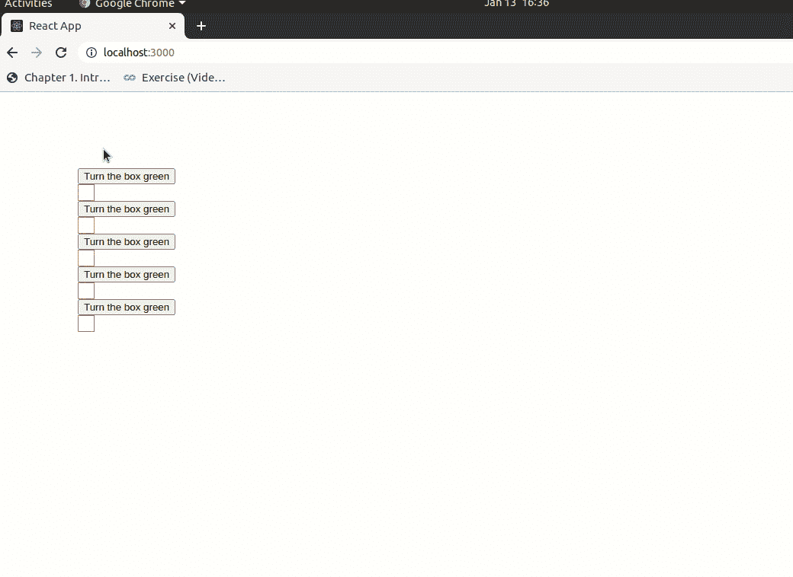

# 如何在 ReactJS 中的咝咝声之间切换？

> 原文:[https://www . geeksforgeeks . org/如何在 sibling-in-reactjs/](https://www.geeksforgeeks.org/how-to-toggle-between-sibiling-in-reactjs/)之间切换

当按钮悬停时，我们如何使兄弟框显示为绿色？

我们可以用名称索引来保持一个状态，以保持悬停按钮的序列号。当用户将鼠标离开按钮时，状态将为空。并且基于状态的值，盒子将有类使它变成绿色。

**创建反应应用程序:**

**步骤 1:** 使用以下命令创建一个反应应用程序:

```jsx
npx create-react-app foldername
```

**步骤 2:** 创建项目文件夹(即文件夹名称)后，使用以下命令移动到该文件夹:

```jsx
cd foldername
```

**项目结构:**如下图。


**App.js 文件:**现在在 App.js 中写代码，App 是默认组件。

## java 描述语言

```jsx
import {React , Component} from 'react';
import './App.css'; 
class App extends Component{

    state = {
        index: null
      };

      fetchUI  = ()=> {

        let ans = [];
      for(let i=0;i<5;i++){
        const greenClass = (this.state.index === i) ? 'green' : '';

        const data = 
          <div>
            <button onMouseOver={() => {
                this.setState({ index: i });
             }}
             onMouseLeave={() => {
                this.setState({ index: null });
             }}  
            >
             Turn the box green
           </button>
           <div className={'box '+greenClass}>
           </div>
         </div>

         ans.push(data)
      }
      return ans
    }

    render = () =>{

      const ans = this.fetchUI()
      return (
         <div style = {{margin:100}}>
          {ans}
        </div>
      );
    }
  }

  export default App
```

**App.css:** 在 src 文件夹中添加 App.css 文件，创建盒子，使其变成绿色。

## 半铸钢ˌ钢性铸铁(Cast Semi-Steel)

```jsx
.box{
    border:1px solid rgb(194, 106, 106);
    height:20px;
    width:20px;
  }
  .green{
    background:green;
    cursor: pointer;
  }
```

**输出:**

