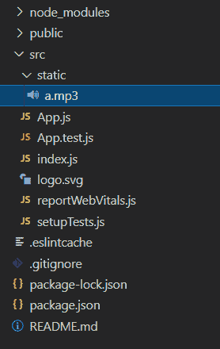

# 如何在带有音频的 ReactJS 中切换播放/暂停？

> 原文:[https://www . geeksforgeeks . org/how-toggle-play-pause-in-reactjs-with-audio/](https://www.geeksforgeeks.org/how-to-toggle-play-pause-in-reactjs-with-audio/)

在本文中，我们将学习使用 [ReactJS](https://www.geeksforgeeks.org/reactjs-tutorials/) 为音频文件创建播放/暂停按钮

**方法:**我们将使用以下步骤:

*   使用**音频类**引用 ReactJS 中的音频文件
*   将歌曲的默认状态设置为不播放。
*   创建一个功能来处理歌曲的播放/暂停。
*   使用音频类的 **play()** 和 **pause()** 功能进行这些操作。

```jsx
let song = new Audio(my_song);
song.play();
song.pause();
```

**设置环境和执行:**

**步骤 1:** 创建反应应用程序命令

```jsx
npx create-react-app foldername
```

**步骤 2:** 创建项目文件夹，即文件夹名称后，使用以下命令移动到该文件夹:

```jsx
cd foldername
```

**步骤 3:** 创建一个 Static 文件夹，并向其中添加一个音频文件。

**项目结构:**如下图。



**示例:**

App.js

```jsx
import React, { Component } from "react";

// Import your audio file
import song from "./static/a.mp3";

class App extends Component {
  // Create state
  state = {

    // Get audio file in a variable
    audio: new Audio(song),

    // Set initial state of song
    isPlaying: false,
  };

  // Main function to handle both play and pause operations
  playPause = () => {

    // Get state of song
    let isPlaying = this.state.isPlaying;

    if (isPlaying) {
      // Pause the song if it is playing
      this.state.audio.pause();
    } else {

      // Play the song if it is paused
      this.state.audio.play();
    }

    // Change the state of song
    this.setState({ isPlaying: !isPlaying });
  };

  render() {
    return (
      <div>
        {/* Show state of song on website */}
        <p>
          {this.state.isPlaying ? 
            "Song is Playing" : 
            "Song is Paused"}
        </p>

        {/* Button to call our main function */}
        <button onClick={this.playPause}>
          Play | Pause
        </button>
      </div>
    );
  }
}

export default App; 
```