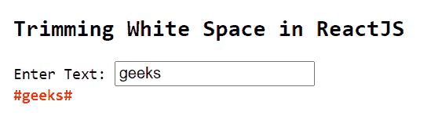
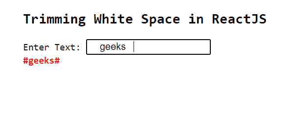

# 如何在 ReactJS 中修剪输入的空白？

> 原文:[https://www . geeksforgeeks . org/如何从 reactjs 输入中修剪空格/](https://www.geeksforgeeks.org/how-to-trim-white-spaces-from-input-in-reactjs/)

**修剪空白**是指从开始和结束处删除文本输入中的空白。以下示例显示了如何在 ReactJS 中修剪文本输入的空白。

**创建反应应用程序并安装模块:**

**步骤 1:** 使用以下命令创建一个反应应用程序:

```
npx create-react-app foldername
```

**步骤 2:** 在创建项目文件夹(即文件夹名**)后，使用以下命令将**移动到该文件夹:

```
cd foldername
```

**步骤 3:** 创建 ReactJS 应用程序后，使用以下命令安装**验证器**模块:

```
npm install validator
```

**项目结构:**如下图。


项目结构

**App.js:** 现在在 **App.js** 文件中写下以下代码。在这里，App 是我们编写代码的默认组件。

## java 描述语言

```
import React, { useState } from "react";
import validator from 'validator'

const App = () => {

  const [value, setValue] = useState('')

  const validate = (inputText) => {
      setValue("#"+validator.trim(inputText)+"#")
  }

  return (
    <div style={{
      marginLeft: '200px',
    }}>
      <pre>
        <h2>Trimming White Space in ReactJS</h2>
        <span>Enter Text: </span><input type="text" 
        onChange={(e) => validate(e.target.value)}></input> <br />
        <span style={{
          fontWeight: 'bold',
          color: 'red',
        }}>{value}</span>
      </pre>
    </div>
  );
}

export default App
```

**运行应用程序的步骤:**从项目的根目录使用以下命令运行应用程序:

```
npm start
```

**输出:**

*   如果用户输入时没有任何空格，则输出如下。您可以看到文本保持原样，因为输入文本中没有空格。



*   如果用户从两端输入带有空格的输入，则输出如下。您可以看到，最终输出文本通过删除空白从两侧进行了修剪。



**注意:**在上面的例子中， **#** 是从两端追加的，这样用户就可以看到删除空白的结果。