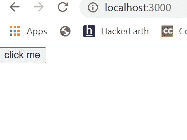

# 如何更新 ReactJS 中的父状态？

> 原文:[https://www . geeksforgeeks . org/如何更新-父状态-in-reactjs/](https://www.geeksforgeeks.org/how-to-update-parent-state-in-reactjs/)

我们可以将设置状态的函数作为一个道具从父组件传递给子组件。

**创建反应应用程序:**

**步骤 1:** 使用以下命令创建一个反应应用程序:

```jsx
npx create-react-app foldername
```

**步骤 2:** 创建项目文件夹(即文件夹名**)后，使用以下命令移动到该文件夹中:**

```jsx
cd foldername
```

**项目结构:**如下图。


项目结构

**文件名:App.js**

## java 描述语言

```jsx
import React, { Component } from "react";
class App extends Component {

  state = {
    text: 'click me'
  }

  // Function to update state
  handleUpdate = (newtext) => {
    this.setState({ text: newtext })
  }

  render() {
    return (
      <div>
        <Child
          text={this.state.text}

          // Passing a function to child
          updateState={this.handleUpdate}>
        </Child>
      </div>
    );
  }
}
class Child extends Component {

  render() {
    return (
      <button 
        // Using parent props to update parent state
        onClick={() => this.props
            .updateState('parent state changed')}>
        {this.props.text}
      </button>
    )
  }
}

export default App;
```

**运行应用程序的步骤:**从项目的根目录使用以下命令运行应用程序:

```jsx
npm start
```

**输出:**屏幕上会出现如下按钮:



单击前

点击按钮后，输出如下:


点击后