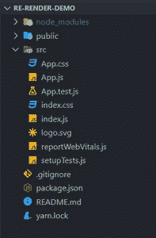
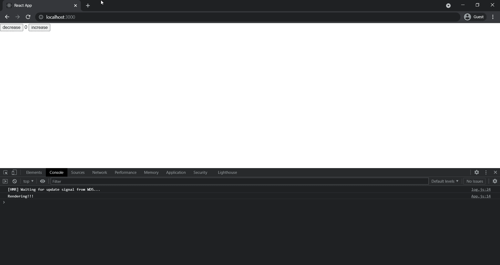

# 如何更新状态以在 ReactJS 中重新渲染组件？

> 原文:[https://www . geeksforgeeks . org/如何更新状态以重新呈现组件 in-reactjs/](https://www.geeksforgeeks.org/how-to-update-state-to-re-render-the-component-in-reactjs/)

react 中的 [useState()](https://www.geeksforgeeks.org/reactjs-usestate-hook/) 钩子允许我们声明一个在重新渲染周期中持续存在的状态变量。如果我们想要重新呈现组件，那么我们可以通过调用 setState()函数来轻松实现，该函数是通过析构调用 useState()钩子返回的数组而获得的。每当我们使用 setState()方法更新状态时，它都会重新呈现当前组件及其子组件。

**语法:**

```jsx
const [state, setState] = useState(initialState)
```

当我们调用 setState 函数时，它会接收最新的状态快照。然后，我们可以在 setState()函数中使用它，并返回我们想要将新状态值更新到的新值。

**语法:**

```jsx
setState((latestState) => {
    // code logic
    return newState;
})
```

**项目设置**

要创建新的 react 项目，请在命令行中使用以下命令

```jsx
npx create-react-app name_of_project
```

运行此命令后，将创建一个新项目，您的项目结构如下所示。



## App.js

```jsx
import { useState } from 'react';

function App() {
  const [counter, setCounter] = useState(0);

  const handleIncrease = () => {
    setCounter((prev) => prev + 1);
  };

  const handleDecrease = () => {
    setCounter((prev) => prev - 1);
  };

  console.log('Rendering!!!');

  return (
    <div>
      <button onClick={handleDecrease}>
         decrease
      </button>
      <span> {counter} </span>
      <button onClick={handleIncrease}>
         increase
      </button>
    </div>
  );
}

export default App;
```

**运行应用程序的步骤:**要启动应用程序，请在命令行中使用以下命令。

```jsx
npm start
```

**输出:**打开浏览器，转到 **http://localhost:3000** ，会看到如下输出。



**说明:**当我们点击增加或减少按钮时，会调用手柄增加或手柄减少功能。在这两个函数中，我们使用 setState()函数更新状态，因此我们的应用程序组件会再次呈现，并在控制台上打印一条消息。