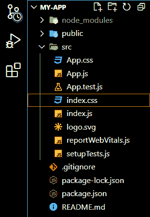

# 如何更新 ReactJS 中组件的状态？

> 原文:[https://www . geeksforgeeks . org/如何更新 reactjs 中的组件状态/](https://www.geeksforgeeks.org/how-to-update-the-state-of-a-component-in-reactjs/)

[状态](https://www.geeksforgeeks.org/reactjs-state-react/)是 React Component 的一个实例，可以定义为控制组件行为的一组可观察属性的对象。换句话说，组件的状态是一个对象，它保存着一些可能在组件生命周期内发生变化的信息。组件的状态可以在生命周期内更新。

一般来说，React 中有两种类型的组件。基于[类的组件](https://www.geeksforgeeks.org/reactjs-class-based-components/)和[功能组件](https://www.geeksforgeeks.org/reactjs-functional-components/)。在这两种类型的组件中，我们更新组件状态的方法是不同的。我们将一个接一个地学习它们。

**创建反应应用程序:**

**步骤 1:** 使用以下命令创建一个反应应用程序:

```
npx create-react-app name_of_the_app
```

**步骤 2:** 创建 react 应用程序后，使用以下命令根据您的应用程序名称移动到目录:

```
cd name_of_the_app
```

**项目结构:**现在在编辑器中打开应用程序文件夹。您将看到以下文件结构:



**1。更新基于类的组件的状态:**现在我们将学习如何更新基于类的组件的状态。下面讨论这些步骤。

*   进入 App.js 文件，清除所有内容。
*   在 App.js 文件导入 React 的顶部，从‘React**’**中选择{Component}。
*   创建一个名为“应用”的基于类的组件。这是我们重建的默认应用组件。
*   使用 this.state 语法创建一个名为 text 的状态对象。给它一个值。
*   在类中创建另一个方法，并使用“this.setState()”方法更新组件的状态。
*   在 JSX 元素中传递状态对象，并调用方法来更新特定事件(如按钮单击)的状态。

**示例:**

**文件名:App.js**

## java 描述语言

```
// The App.js file
import React,{Component} from 'react';

class App extends Component {
  constructor(){
    super()
    this.state={
      text : 'Welcome to Geeksforgeeks'
    }
  }

  goPremium(){
    this.setState({
      text:'Subscription successful'
    })
  }
  render() {
      return (
          <div>
            <h1>{this.state.text}</h1>
            <button onClick={() => this.goPremium()}>
              Go Premium
            </button>
          </div>
      ); 
  }
}

export default App;
```

**运行应用程序的步骤:**打开终端，键入以下命令。

```
npm start
```

**输出:**


**2。更新功能组件的状态:**更新功能组件状态的步骤如下。

*   清除 App.js 文件的 App 组件中的所有内容。
*   在 App.js 文件导入的顶部，从【反应】**中反应{useState}。**
*   在应用程序组件中，使用以下语法创建一个名为“文本”的状态。这是内置的 useState 方法，用于对功能组件进行反应。：

```
const [state, setState] = useState({text:'Default value of the text state'});
```

*   使用“{state.text}”方法将“text”状态传递给 JSX 元素。
*   使用“设置状态”方法更新特定事件(如按钮点击)的状态。语法如下:

```
setState({text:'Updated Content'})
```

**示例:**

**文件名:App.js**

## java 描述语言

```
// App.js file
import React, {useState} from "react";

function App(){
    const [state, setState] = useState({
      text:'Welcome to Geeksforgeeks'
    });
    return (
        <div>
            <h1>{state.text}</h1>
            <button onClick={() => setState({
              text:'Subscription successful'
              })}>
             Go Premium
            </button>
        </div>
    );
};

export default App;
```

**运行应用程序的步骤:**打开终端，键入以下命令。

```
npm start
```

**输出:**

