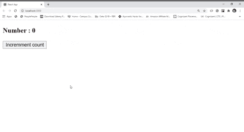

# 如何使用回调更新 react 组件的状态？

> 原文:[https://www . geeksforgeeks . org/如何使用回调更新组件的状态/](https://www.geeksforgeeks.org/how-to-update-the-state-of-react-components-using-callback/)

在反应组件中，状态是可变的。为了使 react 应用程序具有交互性，我们几乎在每个 React 组件中都使用了状态。状态用某个值初始化，基于用户与应用程序的交互，我们使用 setState 方法在某个时间点更新组件的状态。setState 方法允许直接使用 JavaScript 对象更改组件的状态，其中键是状态的名称，值是该状态的更新值。我们经常根据组件的先前状态来更新它的状态。在这些情况下，总是建议使用基于回调的方法来更新状态，因为使用这种方法，可以确保以前的状态完全更新，现在我们根据其以前更新的值来更新状态。社区建议使用基于回调的方法来使用 setState 更新状态，因为它提前解决了未来可能出现的许多 bug。

**语法**

```
this.setState(st => {
  return(
    st.stateName1 = state1UpdatedValue,
    st.stateName2 = state2UpdatedValue
  )
})
```

**示例 1:** 该示例说明了如何使用基于回调的方法更新状态

**index.js :**

## java 描述语言

```
import React from 'react'
import ReactDOM from 'react-dom'
import App from './App'

ReactDOM.render(<App />, document.querySelector('#root'))
```

**app.js :**

## java 描述语言

```
import React, { Component } from 'react'

class App extends Component{
  constructor(props){
    super(props)
    // initialize count state
    this.state = {count : 0}
    // bind this
    this.handleClick = this.handleClick.bind(this)
  }

  // function to run after click
  handleClick(){
    // changing state using callback
    this.setState(st => {
      // count is incremented +1 time
      // based on its previous value
      return st.count += 1
    })
  }

  render(){
    return(
      <div>
        <h3>Number : {this.state.count}</h3>
        <button onClick={this.handleClick}>
            Increment count
        </button>
      </div>

    )
  }
}
export default App
```

**输出:**



**例 2:**

**index.js :**

## java 描述语言

```
import React from 'react'
import ReactDOM from 'react-dom'
import App from './App'

ReactDOM.render(<App />, document.querySelector('#root'))
```

**app.js :**

## java 描述语言

```
import React, { Component } from 'react'

class App extends Component{
  static defaultProps = {
    name : ['John', 'Alex', 'Bob']
  }
  constructor(props){
    super(props)

    // initialize count state
    this.state = {msg : 'Hi There', count:0}
    // bind this
    this.handleClick = this.handleClick.bind(this)
  }

  // function to run after click
  handleClick(){
    // changing state using callback
    this.setState(st => {
      return(
        st.msg = `${st.msg}, ${this.props.name[st.count]}`,
        st.count += 1
      )  
    })
  }

  render(){
    return(
      <div>
        <h3>Greetings!</h3>

<p>{this.state.msg}</p>

        <button onClick={this.handleClick}>
           Say greeting to employees!
        </button>
      </div>

    )
  }
}
export default App
```

**输出:**

