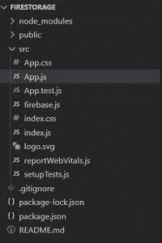
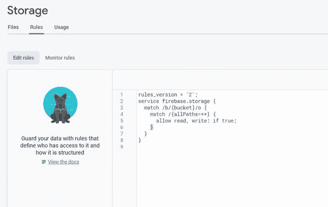
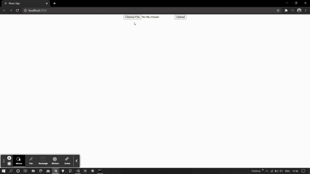
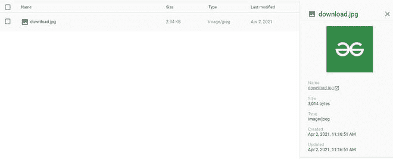

# 如何使用 ReactJS 上传 firebase 存储中的文件？

> 原文:[https://www . geeksforgeeks . org/如何上传文件-in-firebase-storage-use-reactjs/](https://www.geeksforgeeks.org/how-to-upload-files-in-firebase-storage-using-reactjs/)

下面的方法介绍了如何在 react 中将文件发送到 firebase 存储。我们使用了 firebase 模块来实现这一点。

**创建反应应用程序并安装模块:**

*   **步骤 1:** 使用以下命令创建一个反应缅甸:

    ```
    npx create-react-app myapp
    ```

*   **步骤 2:** 创建项目文件夹(即 myapp)后，使用以下命令移动到该文件夹:

    ```
    cd myapp
    ```

**项目结构:**我们的项目结构会是这样的。



**步骤 3:** 创建 ReactJS 应用程序后，使用以下命令安装 firebase 模块:

```
npm install firebase@8.3.1 --save
```

**第 4 步:**转到你的 firebase 仪表盘，创建一个新项目并复制你的凭证。

```
const firebaseConfig = {
      apiKey: "your api key",
      authDomain: "your credentials",
      projectId: "your credentials",
      storageBucket: "your credentials",
      messagingSenderId: "your credentials",
      appId: "your credentials"
};
```

**第 5 步:**通过创建一个带有以下代码的 **firebase.js** 文件，将 Firebase 初始化到您的项目中。

## 火库. js

```
import firebase from 'firebase';
const firebaseConfig = {
    // Your Credentials
  };
firebase.initializeApp(firebaseConfig);
var storage = firebase.storage();
export default storage;
```

**步骤 6:** 现在转到 firebase 项目中的存储部分，更新您的安全规则。这里我们处于测试模式，所以我们允许真实的读写。更新如下所示的代码后。点击发布。



**第 7 步:**现在为我们的项目创建一个基本的 UI。在这里，我们创建了一个选择文件的输入和一个将文件上传到 firebase 存储的按钮。

## App.js

```
function App() {
  return (
    <div className="App">
      <center>
      <input type="file"/>
      <button>Upload</button>
      </center>
    </div>
  );
}

export default App;
```

**第 8 步:**现在实现上传部分。在这里，我们将使用一个名为 put 的方法来帮助我们将文件发送到 firebase 存储。

## App.js

```
import {useState} from 'react';
import storage from './firebase';
function App() {
const [image , setImage] = useState('');
const upload = ()=>{
  if(image == null)
    return;
  storage.ref(`/images/${image.name}`).put(image)
  .on("state_changed" , alert("success") , alert);
}

  return (
    <div className="App">
      <center>
      <input type="file" onChange={(e)=>{setImage(e.target.files[0])}}/>
      <button onClick={upload}>Upload</button>
      </center>
    </div>
  );
}

export default App;
```

**运行应用程序的步骤:**从项目的根目录使用以下命令运行应用程序:

```
npm start
```

**输出:**现在打开浏览器，转到***http://localhost:3000/***，会看到如下输出:



这是我们上传的 firebase 存储中的图像，如下所示:

