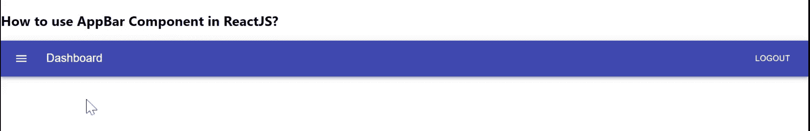

# 如何在 ReactJS 中使用 AppBar 组件？

> 原文:[https://www . geeksforgeeks . org/如何使用-app bar-component-in-reactjs/](https://www.geeksforgeeks.org/how-to-use-appbar-component-in-reactjs/)

应用栏显示与当前屏幕相关的信息和操作。React 的 Material UI 有这个组件可供我们使用，非常容易集成。我们可以使用下面的方法在 ReactJS 中使用 AppBar 组件。

**创建反应应用程序并安装模块:**

**步骤 1:** 使用以下命令创建一个反应应用程序:

```jsx
npx create-react-app foldername
```

**步骤 2:** 创建项目文件夹(即文件夹名**)后，使用以下命令移动到该文件夹中:**

```jsx
cd foldername
```

**步骤 3:** 创建 ReactJS 应用程序后，使用以下命令安装 **material-ui** 模块:

```jsx
npm install @material-ui/core
npm install @material-ui/icons
```

**App.js:** 现在在 **App.js** 文件中写下以下代码。在这里，App 是我们编写代码的默认组件。

## java 描述语言

```jsx
import React from "react";
import Toolbar from "@material-ui/core/Toolbar";
import AppBar from "@material-ui/core/AppBar";
import Typography from "@material-ui/core/Typography";
import IconButton from "@material-ui/core/IconButton";
import Button from "@material-ui/core/Button";
import MenuIcon from "@material-ui/icons/Menu";

const App = () => {
  return (
    <div>
      <h2>How to use AppBar Component in ReactJS?</h2>
      <AppBar position="static">
        <Toolbar>
          <IconButton
            edge="start"
            style={{
              marginRight: 20,
            }}
            color="inherit"
            aria-label="menu"
          >
            <MenuIcon />
          </IconButton>
          <Typography
            variant="h6"
            style={{
              flexGrow: 1,
            }}
          >
            Dashboard
          </Typography>
          <Button color="inherit">Logout</Button>
        </Toolbar>
      </AppBar>
    </div>
  );
};

export default App;
```

**运行应用程序的步骤:**从项目的根目录使用以下命令运行应用程序。

```jsx
npm start
```

**输出:**现在打开浏览器，转到***http://localhost:3000/***，会看到如下输出。

