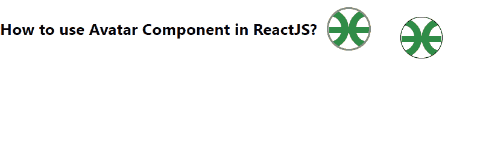

# ReactJS 中如何使用头像组件？

> 原文:[https://www . geeksforgeeks . org/如何使用-avatar-component-in-reactjs/](https://www.geeksforgeeks.org/how-to-use-avatar-component-in-reactjs/)

从表格到对话框菜单，化身在材料设计中随处可见。【React 的 Material UI 有这个组件可供我们使用，非常容易集成。我们可以使用以下方法在 ReactJS 中使用化身组件。

**创建反应应用程序并安装模块:**

**步骤 1:** 使用以下命令创建一个 React 应用程序。

```jsx
npx create-react-app foldername
```

**步骤 2:** 在创建项目文件夹(即文件夹名**)后，使用以下命令移动到该文件夹。**

```jsx
cd foldername
```

**步骤 3:** 创建 ReactJS 应用程序后，使用以下命令安装 **material-ui** 模块。

```jsx
npm install @material-ui/core
```

**项目结构:**如下图。


项目结构

**示例:**现在在 **App.js** 文件中写下以下代码。在这里，App 是我们编写代码的默认组件。

## App.js

```jsx
import React from "react";
import Avatar from "@material-ui/core/Avatar";

export default function App() {
  return (
    <div style={{ display: "flex" }}>
      <h4>How to use Avatar Component in ReactJS?</h4>
      <Avatar
        style={{ border: "2px solid gray", margin: 10 }}
        alt="GeeksforGeeks Pic 1"
        src=
"https://write.geeksforgeeks.org/static/media/Group%20210.08204759.svg"
      />
      <Avatar
        style={{ border: "1px solid black", margin: 20 }}
        alt="GeeksforGeeks Pic 2"
        src=
"https://write.geeksforgeeks.org/static/media/Group%20210.08204759.svg"
      />
    </div>
  );
}
```

**运行应用程序的步骤:**从项目的根目录使用以下命令运行应用程序。

```jsx
npm start
```

**输出:**现在打开浏览器，转到***http://localhost:3000/***，会看到如下输出。



**参考:**T2】https://material-ui.com/components/avatars/