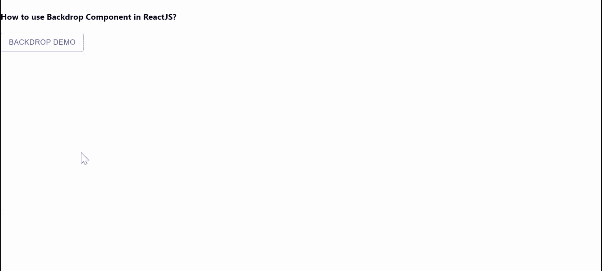

# ReactJS 中如何使用背景组件？

> 原文:[https://www . geeksforgeeks . org/如何使用-background-component in-reactjs/](https://www.geeksforgeeks.org/how-to-use-backdrop-component-in-reactjs/)

背景部分用于强调特定的元素或部分元素。【React 的 Material UI 有这个组件可供我们使用，非常容易集成。我们可以使用以下方法在 ReactJS 中使用背景组件。

**创建反应应用程序并安装模块:**

**步骤 1:** 使用以下命令创建一个 React 应用程序。

```jsx
npx create-react-app foldername
```

**步骤 2:** 在创建项目文件夹(即文件夹名**)后，使用以下命令移动到该文件夹。**

```jsx
cd foldername
```

**步骤 3:** 创建 ReactJS 应用程序后，使用以下命令安装 **material-ui** 模块。

```jsx
npm install @material-ui/core
```

**项目结构:**如下图。


项目结构

**示例:**现在在 **App.js** 文件中写下以下代码。在这里，App 是我们编写代码的默认组件。

## App.js

```jsx
import React from "react";
import Button from "@material-ui/core/Button";
import CircularProgress from "@material-ui/core/CircularProgress";
import { makeStyles } from "@material-ui/core/styles";
import Backdrop from "@material-ui/core/Backdrop";

const useStyles = makeStyles((theme) => ({
  backdrop: {
    color: "#fff",
    zIndex: theme.zIndex.drawer + 1,
  },
}));

export default function App() {
  const classes = useStyles();
  const [open, setOpen] = React.useState(false);

  return (
    <div>
      <h4>How to use Backdrop Component in ReactJS?</h4>
      <Button
        variant="outlined"
        color="primary"
        onClick={() => {
          setOpen(!open);
        }}
      >
        Backdrop Demo
      </Button>
      <Backdrop
        className={classes.backdrop}
        open={open}
        onClick={() => {
          setOpen(false);
        }}
      >
        <CircularProgress color="inherit" />
      </Backdrop>
    </div>
  );
}
```

**运行应用程序的步骤:**从项目的根目录使用以下命令运行应用程序。

```jsx
npm start
```

**输出:**现在打开浏览器，转到***http://localhost:3000/***，会看到如下输出。



**参考:**T2】https://material-ui.com/components/backdrop/