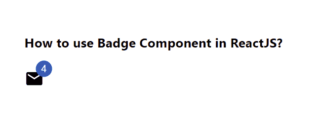

# 如何在 ReactJS 中使用徽章组件？

> 原文:[https://www . geesforgeks . org/how-用法-badge-in-component-reactjs/](https://www.geeksforgeeks.org/how-to-use-badge-component-in-reactjs/)

徽章在其子组件的右上角生成一个小徽章。【React 的 Material UI 有这个组件可供我们使用，非常容易集成。我们可以使用以下方法在 ReactJS 中使用徽章组件。

**创建反应应用程序并安装模块:**

**步骤 1:** 使用以下命令创建一个 React 应用程序。

```jsx
npx create-react-app foldername
```

**步骤 2:** 在创建项目文件夹(即文件夹名**)后，使用以下命令移动到该文件夹。**

```jsx
cd foldername
```

**步骤 3:** 创建 ReactJS 应用程序后，使用以下命令安装 **material-ui** 模块。

```jsx
npm install @material-ui/core
npm install @material-ui/icons
```

**项目结构:**如下图。


项目结构

**示例:**现在在 **App.js** 文件中写下以下代码。在这里，App 是我们编写代码的默认组件。

## App.js

```jsx
import React from 'react';
import MailIcon from '@material-ui/icons/Mail';
import Badge from '@material-ui/core/Badge';

export default function App() {

  return (
     <div style={{display: 'block', padding: 30}}>
      <h4>How to use Badge Component in ReactJS?</h4>
      <Badge badgeContent={4} 
      color="primary">
        <MailIcon />
      </Badge>
    </div>
  );
}
```

**运行应用程序的步骤:**从项目的根目录使用以下命令运行应用程序。

```jsx
npm start
```

**输出:**现在打开浏览器，转到***http://localhost:3000/***，会看到如下输出。



**参考:**T2】https://material-ui.com/components/badges/