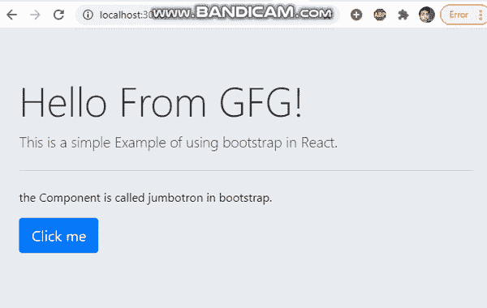

# 如何在 ReactJS 中使用 Bootstrap？

> 原文:[https://www . geeksforgeeks . org/how-用法-bootstrap-in-reactjs/](https://www.geeksforgeeks.org/how-to-use-bootstrap-in-reactjs/)

在我们的 ReactJS 项目中，有以下几种方法可以使用引导。

**1。使用引导 CDN:** 在 React 应用程序中使用引导的最简单方法是使用 Bootstrap CDN。不需要下载或安装。只需在应用程序的头部提供一个链接，如下例所示。

> <link rel="”stylesheet”" href="”https://stackpath.bootstrapcdn.com/bootstrap/<br/">4 . 1 . 0/CSS/bootstrap . min . CSS "
> 完整性= " sha 384-9 gvq 4 dyfwsjidznlonxcjeswfphwgpx 1 jddihogiu 1 fwo 5 qrgvfxodjz 4】
> 交叉起源= "匿名">

**2。使用反应引导库:**如果您正在使用构建工具或像 webpack 这样的包捆绑器，这是将引导应用于反应程序的推荐方法。引导必须作为应用程序的依赖项安装。

```
npm install bootstrap
```

**3。安装一个 React Bootstrap 包:**将 Bootstrap 集成到 React 应用程序中的第三个选择是使用一个包，该包包含可用作 React 组件的重建 Bootstrap 组件。以下是两种最常见的软件包:

*   反应自举
*   反应阱

在下面的例子中，我们已经实现了在 ReactJS 项目中使用 Bootstrap 的第一种方法。

**创建反应应用程序:**

*   **步骤 1:** 使用以下命令创建一个反应应用程序:

    ```
    npx create-react-app foldername
    ```

*   **步骤 2:** 创建项目文件夹(即文件夹名)后，使用以下命令移动到该文件夹:

    ```
    cd foldername
    ```

**项目结构:**如下图。


**示例:**现在在 **App.js** 文件中写下以下代码。在这里，App 是我们编写代码的默认组件。

## App.js

```
import React, { useState } from 'react';

class App extends React.Component {
  constructor(props) {
    super(props)
    this.state = {
      counter: 0
    }
    this.handleClick = this.handleClick.bind(this);
  }

  handleClick = () => {
    console.log("hi")
    alert("The value of counter is :" + this.state.counter)
    this.setState({ counter: this.state.counter + 1 })
  }

  render() {
    return (
      <div >
        <div className="jumbotron">
          <h1 className="display-4">Hello From GFG!</h1>
          <p className="lead">This is a simple Example of using 
          bootstrap in React.</p>

          <hr className="my-4" />
          <p>the Component is called jumbotron in bootstrap.</p>

          <p className="lead">
            <a onClick={this.handleClick}
              className="btn btn-primary btn-lg" href="#" 
              role="button">Click me</a>
          </p>

        </div>
      </div>
    );
  }
}

export default App;
```

 <course-video>**运行应用程序的步骤:**从项目的根目录使用以下命令运行应用程序:

```
npm start
```

**输出:**现在打开浏览器，转到***http://localhost:3000/***，会看到如下输出:

</course-video>