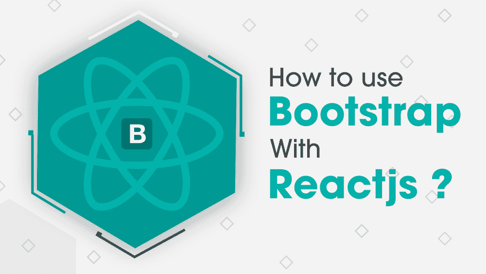

# 如何使用 Bootstrap 和 React？

> 原文:[https://www . geeksforgeeks . org/如何使用引导与反应/](https://www.geeksforgeeks.org/how-to-use-bootstrap-with-react/)

我们都知道 React 的受欢迎程度，以及这个库如何让前端开发人员更容易完成开发任务。React 是构建应用程序用户界面最流行的前端库。行业正在慢慢减少使用 jQuery 和 DOM 库来构建应用程序。



当涉及到构建一个响应性的应用程序时，CSS 框架在市场上是有用的。如果你是一名前端开发人员，那么 Bootstrap、Foundation 和布尔玛类型的框架对你来说并不陌生。大多数行业使用 Bootstrap 框架。数百万个网站运行在 bootstrap 上。

在这个博客中，我们将讨论如何使用 React 和 bootstrap，如何向 React 应用程序添加 Bootstrap。如何安装 React 引导包以及如何在 React 应用程序中使用它。让我们从它开始…

### **添加自举反应的方法**

主要有三种方法可以将引导添加到 React 应用程序中。我们将逐一讨论。

1.  使用自举 CDN。
2.  作为依赖项在反应中导入引导
3.  安装反应引导包(如引导反应或反应陷阱)。

### 1.使用自举 CDN

这是在您的 React 应用程序中使用引导的最简单方法之一。bootstrap CDN 最大的优点是不需要安装或下载。你只需要在你的应用的头部复制并粘贴一个链接就可以了。下面是你需要的链接。

```
<link rel="stylesheet" href="https://stackpath.bootstrapcdn.com/bootstrap/4.1.0/css/bootstrap.min.css" 
integrity="sha384-9gVQ4dYFwwWSjIDZnLEWnxCjeSWFphJiwGPXr1jddIhOegiu1FwO5qRGvFXOdJZ4" 
crossorigin="anonymous">
```

如果您的应用程序需要 JavaScript 组件和引导程序，那么在页面底部放置

```
<script src="https://code.jquery.com/jquery-3.3.1.slim.min.js" 
integrity="sha384-q8i/X+965DzO0rT7abK41JStQIAqVgRVzpbzo5smXKp4YfRvH+8abtTE1Pi6jizo" 
crossorigin="anonymous"></script>

<script src="https://cdnjs.cloudflare.com/ajax/libs/popper.js/1.14.0/umd/popper.min.js" 
integrity="sha384-cs/chFZiN24E4KMATLdqdvsezGxaGsi4hLGOzlXwp5UZB1LY//20VyM2taTB4QvJ" 
crossorigin="anonymous"></script>

<script src="https://stackpath.bootstrapcdn.com/bootstrap/4.1.0/js/bootstrap.min.js" 
integrity="sha384-uefMccjFJAIv6A+rW+L4AHf99KvxDjWSu1z9VI8SKNVmz4sk7buKt/6v9KI65qnm" 
crossorigin="anonymous"></script>
```

这些片段将被添加到 public/index.html 页面。

### **2。将引导作为依赖项导入**

您可能在应用程序中使用过一些模块捆绑器或 webpack，或者您可能听过这些名称。这是向您的 React 应用程序添加引导的另一个选项。您可以运行下面给出的命令，并在应用程序中作为依赖项安装引导。

```
npm install bootstrap
```

安装后，将它添加到应用程序条目的 JavaScript 文件中。下面是 src 文件夹中的 index.js 文件。

```
import 'bootstrap/dist/css/bootstrap.min.css';
import React from 'react';
import ReactDOM from 'react-dom';
import './index.css';
import App from './App';
import registerServiceWorker from './registerServiceWorker';

ReactDOM.render(<App />, document.getElementById('root'));
registerServiceWorker();
```

在上面第一行的代码中，我们已经导入了 Bootstrap 缩小的 CSS 作为第一个依赖项。有了这个，我们可以在我们的 React 组件中使用 Bootstrap 类。您还需要安装 **jQuery** 和 **popper.js** 以及这个。下面是安装它们的命令。

```
npm install jquery popper.js
```

在 **index.js** 文件中进行以下更改，以添加新的依赖关系。

```
import 'bootstrap/dist/css/bootstrap.min.css';
import $ from 'jquery';
import Popper from 'popper.js';
import 'bootstrap/dist/js/bootstrap.bundle.min';
import React from 'react';
import ReactDOM from 'react-dom';
import './index.css';
import App from './App';
import registerServiceWorker from './registerServiceWorker';

ReactDOM.render(<Dropdown />, document.getElementById('root'));
registerServiceWorker();
```

### 3.安装反应引导包

在您的 React 组件中添加引导的另一种方法是添加带有内置引导组件的包。这些设计用于您的 React 应用程序组件。下面是两个流行包的名字。

*   [反应-自举](https://react-bootstrap.github.io/)
*   [反应堆捕集器](https://react-bootstrap.github.io/)

两者都是使用 Bootstrap 和 React 应用程序的好选择。

### 使用引导程序创建反应应用程序

使用下面给出的命令在您的机器上创建一个反应应用程序。

```
create-react-app my-app
```

现在，运行下面给出的命令来安装下面给出的依赖项。

```
yarn add axios bootstrap reactstrap
```

这里我们安装了 Axios 作为一个依赖项，它是一个 JavaScript 库，用来从 node.js 发出 HTTP 请求或者从浏览器发出 XMLHttpRequests。Axios 允许你从[<u>BaconIpsum JSON API</u>](https://baconipsum.com/json-api/)获取帖子。

现在使用这个 Bootstrap 精简的 CSS 文件。您需要对 **src/index.js** 文件进行一些修改，使其包含如下内容…

```
import 'bootstrap/dist/css/bootstrap.min.css';
import React from 'react';
import ReactDOM from 'react-dom';
import './index.css';
import App from './App';
import registerServiceWorker from './registerServiceWorker';

ReactDOM.render(<App />, document.getElementById('root'));
registerServiceWorker();
```

现在在项目的 src 目录中创建一个文件夹组件。在其中创建一个新文件 **Header.js，**，并编写下面给出的代码。

```
import React from 'react';
import logo from '../logo.svg';

import {
  Container, Row, Col, Form, Input, Button, Navbar, Nav,
  NavbarBrand, NavLink, NavItem, UncontrolledDropdown,
  DropdownToggle, DropdownMenu, DropdownItem
} from 'reactstrap';

const AVATAR = 'https://www.gravatar.com/avatar/429e504af19fc3e1cfa5c4326ef3394c?s=240&d=mm&r=pg';

const Header = () => (
  <header>
    <Navbar fixed="top" color="light" light expand="xs" className="border-bottom border-gray bg-white" style={{ height: 80 }}>

      <Container>
        <Row noGutters className="position-relative w-100 align-items-center">

          <Col className="d-none d-lg-flex justify-content-start">
            <Nav className="mrx-auto" navbar>

              <NavItem className="d-flex align-items-center">
                <NavLink className="font-weight-bold" href="/">
                  
                </NavLink>
              </NavItem>

              <NavItem className="d-flex align-items-center">
                <NavLink className="font-weight-bold" href="/">Home</NavLink>
              </NavItem>

              <NavItem className="d-flex align-items-center">
                <NavLink className="font-weight-bold" href="/">Electronics</NavLink>
              </NavItem>

              <UncontrolledDropdown className="d-flex align-items-center" nav inNavbar>
                <DropdownToggle className="font-weight-bold" nav caret>fashion</DropdownToggle>
                <DropdownMenu right>
                  <DropdownItem className="font-weight-bold text-secondary text-uppercase" header disabled>Learn React</DropdownItem>
                  <DropdownItem divider />
                  <DropdownItem>Men</DropdownItem>
                  <DropdownItem>Women</DropdownItem>
                  <DropdownItem>Baby and Kids</DropdownItem>
                </DropdownMenu>
              </UncontrolledDropdown>

            </Nav>
          </Col>

          <Col className="d-flex justify-content-xs-start justify-content-lg-center">
            <NavbarBrand className="d-inline-block p-0" href="/" style={{ width: 80 }}>
              
            </NavbarBrand>
          </Col>

          <Col className="d-none d-lg-flex justify-content-end">
            <Form inline>
              <Input type="search" className="mr-3" placeholder="Search React Courses" />
              <Button type="submit" color="info" outline>Search</Button>
            </Form>
          </Col>

        </Row>
      </Container>

    </Navbar>
  </header>
);

export default Header;
```

在上面的代码中，我们包含了导航菜单。现在我们在组件目录中创建一个文件 **LeftCard.js** 文件，内容如下:

```
import React, { Fragment } from 'react';

import {
  Button, UncontrolledAlert, Card, CardImg, CardBody,
  CardTitle, CardSubtitle, CardText
} from 'reactstrap';

const BANNER = 'https://i.imgur.com/CaKdFMq.jpg';

const LeftCard = () => (
  <Fragment>

    <UncontrolledAlert color="danger" className="d-none d-lg-block">
      <strong>Account not activated.</strong>
    </UncontrolledAlert>

    <Card>
      <CardImg top width="100%" src={BANNER} alt="banner" />
      <CardBody>
        <CardTitle className="h3 mb-2 pt-2 font-weight-bold text-secondary">Lorem Ipsum</CardTitle>
        <CardSubtitle className="text-secondary mb-3 font-weight-light text-uppercase" style={{ fontSize: '0.8rem' }}>Lorem Ipsum, Lagos</CardSubtitle>
        <CardText className="text-secondary mb-4" style={{ fontSize: '0.75rem' }}>Lorem Ipsum has been the industry's standard dummy text ever since the 1500s, when an unknown printer took a gallery of type and scrambled it to make a type specimen book</CardText>
        <Button color="success" className="font-weight-bold">Lorem Ipsum</Button>
      </CardBody>
    </Card>

  </Fragment>
);

export default LeftCard;
```

现在在**组件的**目录中创建一个文件 **Post.js** ，并添加下面给出的片段…

```
import React, { Component, Fragment } from 'react';
import axios from 'axios';
import { Badge } from 'reactstrap';

class Post extends Component {

  state = { post: null }

  componentDidMount() {
    axios.get('https://baconipsum.com/api/?type=meat-and-filler&paras=4&format=text')
      .then(response => this.setState({ post: response.data }));
  }

  render() {
    return (
      <Fragment>
        { this.state.post && <div className="position-relative">

          <span className="d-block pb-2 mb-0 h6 text-uppercase text-info font-weight-bold">
            Editor's Pick
            <Badge pill color="success" className="text-uppercase px-2 py-1 ml-3 mb-1 align-middle" style={{ fontSize: '0.75rem' }}>New</Badge>
          </span>

          <span className="d-block pb-4 h2 text-dark border-bottom border-gray">React Tutorial</span>

          <article className="pt-5 text-secondary text-justify" style={{ fontSize: '0.9rem', whiteSpace: 'pre-line' }}>{this.state.post}</article>

        </div> }
      </Fragment>
    );
  }

}

export default Post;
```

上面的代码片段呈现了页面上的帖子。在上面的代码中，post 的状态将被初始化为 null。当 React 页面将呈现并且组件挂载时，我们使用 Axios 从 BaconIpsum JSON API 获取这四个段落。在此之后，状态将被更改为 post 属性。

在 **src/App.js** 文件中进行最终修改，如下所示…

```
import React, { Fragment } from 'react';
import axios from 'axios';
import { Container, Row, Col } from 'reactstrap';

import Post from './components/Post';
import Header from './components/Header';
import LeftCard from './components/LeftCard';

const App = () => (
  <Fragment>

    <Header />

    <main className="my-5 py-5">
      <Container className="px-0">
        <Row noGutters className="pt-2 pt-md-5 w-100 px-4 px-xl-0 position-relative">

          <Col xs={{ order: 2 }} md={{ size: 4, order: 1 }} tag="aside" className="pb-5 mb-5 pb-md-0 mb-md-0 mx-auto mx-md-0">
            <SideCard />
          </Col>

          <Col xs={{ order: 1 }} md={{ size: 7, offset: 1 }} tag="section" className="py-5 mb-5 py-md-0 mb-md-0">
            <Post />
          </Col>

        </Row>
      </Container>
    </main>

  </Fragment>
);

export default App;
```

### **结论**

因此，我们讨论了在 React 应用程序中包含引导的多种方法。我们还讨论了使用 react-bootstrap 库。警报、徽章、导航栏、下拉菜单、按钮、卡片、导航、表格等。是您将经常使用的 React 中引导库的常见组件。其他有用的组件有表格、模式、工具提示、轮播、乱码、分页、标签等。React bootstrap 在给出网站布局和设计用户界面方面非常有用。一旦你开始使用它，你就会知道它的组件的用途。