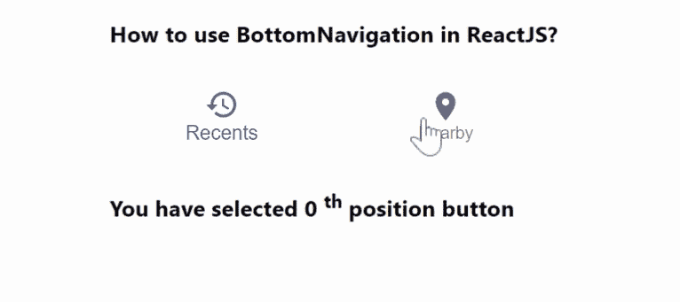

# 如何在 ReactJS 中使用底部导航组件？

> 原文:[https://www . geeksforgeeks . org/how-用法-bottom navigation-component-in-reactjs/](https://www.geeksforgeeks.org/how-to-use-bottomnavigation-component-in-reactjs/)

底部导航栏允许在应用程序的主要目的地之间移动。【React 的 Material UI 有这个组件可供我们使用，非常容易集成。我们可以使用下面的方法在 ReactJS 中使用底部导航组件。

**创建反应应用程序并安装模块:**

**步骤 1:** 使用以下命令创建一个反应应用程序:

```
npx create-react-app foldername
```

**步骤 2:** 创建项目文件夹(即文件夹名**)后，使用以下命令移动到该文件夹中:**

```
cd foldername
```

**步骤 3:** 创建 ReactJS 应用程序后，使用以下命令安装 **material-ui** 模块:

```
npm install @material-ui/core
npm install @material-ui/icons
```

**项目结构:**如下图。


项目结构

**App.js:** 现在在 **App.js** 文件中写下以下代码。在这里，App 是我们编写代码的默认组件。

## java 描述语言

```
import React from "react";
import BottomNavigation from "@material-ui/core/BottomNavigation";
import LocationOnIcon from "@material-ui/icons/LocationOn";
import RestoreIcon from "@material-ui/icons/Restore";
import BottomNavigationAction from "@material-ui/core/BottomNavigationAction";

const App = () => {
  const [value, setValue] = React.useState(0);

  return (
    <div
      style={{
        margin: "auto",
        display: "table",
      }}
    >
      <h4>How to use BottomNavigation in ReactJS?</h4>
      <BottomNavigation
        showLabels
        value={value}
        onChange={(e, newValue) => {
          setValue(newValue);
        }}
      >
        <BottomNavigationAction label="Recents"
                                icon={<RestoreIcon />} />
        <BottomNavigationAction label="Nearby" 
                                icon={<LocationOnIcon />} />
      </BottomNavigation>
      <h4>
        You have selected {value} <sup>th</sup> position button
      </h4>
    </div>
  );
};

export default App;
```

**运行应用程序的步骤:**从项目的根目录使用以下命令运行应用程序。

```
npm start
```

**输出:**现在打开浏览器，转到***http://localhost:3000/***，会看到如下输出。

