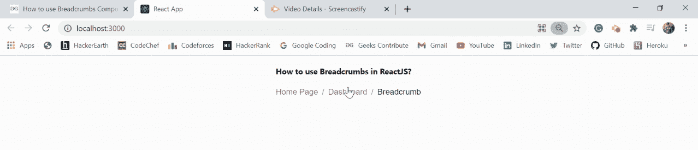

# 如何在 ReactJS 中使用面包屑组件？

> 原文:[https://www . geeksforgeeks . org/how-用法-面包屑-组件 in-reactjs/](https://www.geeksforgeeks.org/how-to-use-breadcrumbs-component-in-reactjs/)

面包屑允许用户从一系列值中进行选择。【React 的 Material UI 有这个组件可供我们使用，非常容易集成。我们可以使用以下方法在 ReactJS 中使用面包屑组件。

**创建反应应用程序并安装模块:**

**步骤 1:** 使用以下命令创建一个 React 应用程序。

```
npx create-react-app foldername
```

**步骤 2:** 在创建项目文件夹(即文件夹名**)后，使用以下命令移动到该文件夹。**

```
cd foldername
```

**步骤 3:** 创建 ReactJS 应用程序后，使用以下命令安装 **material-ui** 模块。

```
npm install @material-ui/core
```

**项目结构:**如下图。


项目结构

**文件名- App.js:** 现在在 **App.js** 文件中写下以下代码。在这里，App 是我们编写代码的默认组件。

## java 描述语言

```
import React from "react";
import Link from "@material-ui/core/Link";
import Typography from "@material-ui/core/Typography";
import Breadcrumbs from "@material-ui/core/Breadcrumbs";

const App = () => {
  return (
    <div
      style={{
        margin: "auto",
        display: "table",
      }}
    >
      <h4>How to use Breadcrumbs in ReactJS?</h4>
      <Breadcrumbs aria-label="breadcrumb">
        <Link
          color="inherit"
          href="/"
          onClick={(event) => {
            event.preventDefault();
            alert("Home Page Clicked");
          }}
        >
          Home Page
        </Link>
        <Link
          color="inherit"
          href="/getting-started/installation/"
          onClick={(event) => {
            event.preventDefault();
            alert("Dashboard Clicked");
          }}
        >
          Dashboard
        </Link>
        <Typography color="textPrimary">
            Breadcrumb
        </Typography>
      </Breadcrumbs>
    </div>
  );
};

export default App;
```

**运行应用程序的步骤:**从项目的根目录使用以下命令运行应用程序:

```
npm start
```

**输出:**现在打开浏览器，转到***http://localhost:3000/***，会看到如下输出。

