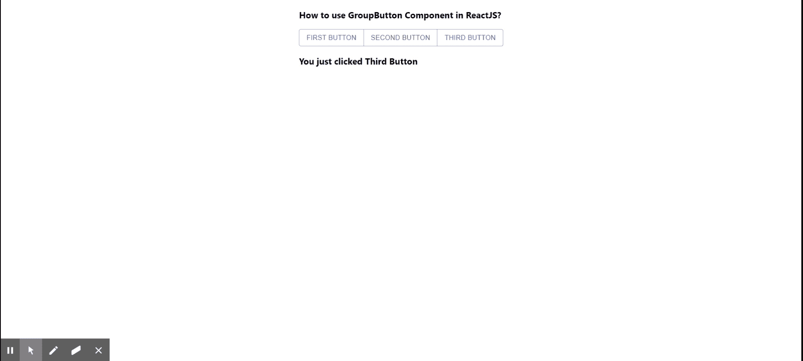

# 如何在 ReactJS 中使用 ButtonGroup 组件？

> 原文:[https://www . geesforgeks . org/how-用法-button group-component-in-reactjs/](https://www.geeksforgeeks.org/how-to-use-buttongroup-component-in-reactjs/)

按钮组组件可用于对相关按钮进行分组。React 的 Material UI 有这个组件可供我们使用，非常容易集成。我们可以在 ReactJS 中使用按钮组组件，方法如下:

**创建反应应用程序并安装模块:**

**步骤 1:** 使用以下命令创建一个反应应用程序:

```jsx
npx create-react-app foldername
```

**步骤 2:** 创建项目文件夹(即文件夹名**)后，使用以下命令移动到该文件夹中:**

```jsx
cd foldername
```

**步骤 3:** 创建 ReactJS 应用程序后，使用以下命令安装 **material-ui** 模块:

```jsx
npm install @material-ui/core
```

**项目结构:**如下图。


项目结构

**App.js:** 现在在 **App.js** 文件中写下以下代码。在这里，App 是我们编写代码的默认组件。

## java 描述语言

```jsx
import React, { useState } from 'react';
import Button from '@material-ui/core/Button';
import ButtonGroup from '@material-ui/core/ButtonGroup';

const App = () => {

  const [message, setMessage] = useState('')

  return (
    <div style={{
      margin: 'auto',
      display: 'block',
      width: 'fit-content'
    }}>
      <h3>How to use GroupButton Component in ReactJS?</h3>
      <ButtonGroup color="primary" 
                   aria-label="outlined primary button group">
        <Button
          onClick={()=> {
            setMessage('You just clicked First Button')
          }}
        >First Button</Button>
        <Button
           onClick={()=> {
            setMessage('You just clicked Second Button')
          }}
        >Second Button</Button>
        <Button
           onClick={()=> {
            setMessage('You just clicked Third Button')
          }}
        >Third Button</Button>
      </ButtonGroup>

        <h3>{message}</h3>
    </div>
  );
}

export default App;
```

**运行应用程序的步骤:**从项目的根目录使用以下命令运行应用程序:

```jsx
npm start
```

**输出:**现在打开浏览器，转到***http://localhost:3000/***，会看到如下输出:

