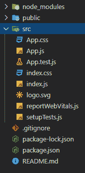
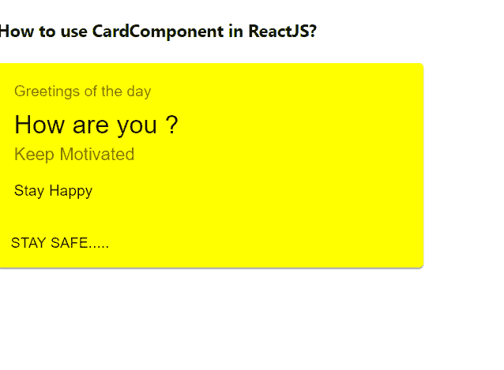

# 如何在 ReactJS 中使用卡片组件？

> 原文:[https://www . geeksforgeeks . org/如何使用卡中组件 reactjs/](https://www.geeksforgeeks.org/how-to-use-card-component-in-reactjs/)

卡片包含关于单一主题的内容和动作。React 的 Material UI 有这个组件可供我们使用，非常容易集成。我们可以使用以下方法在 ReactJS 中使用卡组件。

**创建反应应用程序并安装模块:**

**步骤 1:** 使用以下命令创建一个 React 应用程序。

```jsx
npx create-react-app foldername
```

**步骤 2:** 在创建项目文件夹(即文件夹名**)后，使用以下命令移动到该文件夹。**

```jsx
cd foldername
```

**步骤 3:** 创建 ReactJS 应用程序后，使用以下命令安装 **material-ui** 模块。

```jsx
npm install @material-ui/core
```

**项目结构:**



**示例:**现在在 **App.js** 文件中写下以下代码。在这里，App 是我们编写代码的默认组件。

## App.js

```jsx
import React from "react";
import Card from "@material-ui/core/Card";
import CardContent from "@material-ui/core/CardContent";
import Typography from "@material-ui/core/Typography";
import Button from "@material-ui/core/Button";
import CardActions from "@material-ui/core/CardActions";

export default function App() {
  return (
    <div style={{}}>
      <h4>How to use CardComponent in ReactJS?</h4>
      <Card
        style={{
          width: 400,
          backgroundColor: "yellow",
        }}
      >
        <CardContent>
          <Typography
            style={{ fontSize: 14 }}
            color="textSecondary"
            gutterBottom
          >
            Greetings of the day
          </Typography>
          <Typography variant="h5" component="h2">
            How are you ?
          </Typography>
          <Typography
            style={{
              marginBottom: 12,
            }}
            color="textSecondary"
          >
            Keep Motivated
          </Typography>
          <Typography variant="body2" component="p">
            Stay Happy
          </Typography>
        </CardContent>
        <CardActions>
          <Button size="small">Stay Safe.....</Button>
        </CardActions>
      </Card>
    </div>
  );
}
```

**运行应用程序的步骤:**从项目的根目录使用以下命令运行应用程序。

```jsx
npm start
```

**输出:**现在打开浏览器，转到***http://localhost:3000/***，会看到如下输出。



**参考:**T2】https://material-ui.com/api/card/