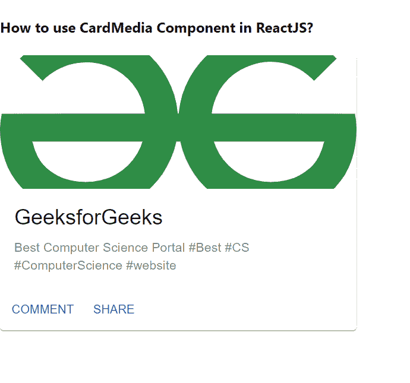

# 如何在 ReactJS 中使用 CardMedia 组件？

> 原文:[https://www . geeksforgeeks . org/如何使用-card media-component-in-reactjs/](https://www.geeksforgeeks.org/how-to-use-cardmedia-component-in-reactjs/)

卡片媒体组件允许用户使用该特定卡片的媒体，如附加照片、视频等。【React 的 Material UI 有这个组件可供我们使用，非常容易集成。我们可以使用以下方法在 ReactJS 中使用 CardMedia 组件。

**创建反应应用程序并安装模块:**

**步骤 1:** 使用以下命令创建一个 React 应用程序。

```
npx create-react-app foldername
```

**步骤 2:** 在创建项目文件夹(即文件夹名**)后，使用以下命令移动到该文件夹。**

```
cd foldername
```

**步骤 3:** 创建 ReactJS 应用程序后，使用以下命令安装 **material-ui** 模块。

```
npm install @material-ui/core
```

**项目结构:**如下图。


项目结构

**示例:**现在在 **App.js** 文件中写下以下代码。在这里，App 是我们编写代码的默认组件。

## App.js

```
import React from "react";
import CardMedia from "@material-ui/core/CardMedia";
import Typography from "@material-ui/core/Typography";
import CardContent from "@material-ui/core/CardContent";
import Card from "@material-ui/core/Card";
import CardActionArea from "@material-ui/core/CardActionArea";
import Button from "@material-ui/core/Button";
import CardActions from "@material-ui/core/CardActions";

export default function App() {
  return (
    <div stlye={{}}>
      <h4>How to use CardMedia Component in ReactJS?</h4>
      <Card style={{ width: 400 }}>
        <CardActionArea>
          <CardMedia
            alt="GeeksforGeeks"
            component="img"
            title="GeeksforGeeks"
            height="150"
            image=
"https://write.geeksforgeeks.org/static/media/Group%20210.08204759.svg"
          />
          <CardContent>
            <Typography gutterBottom variant="h5" component="h2">
              GeeksforGeeks
            </Typography>
            <Typography variant="body2" 
                        color="textSecondary" 
                        component="p">
              Best Computer Science Portal #Best
              #CS #ComputerScience #website
            </Typography>
          </CardContent>
        </CardActionArea>
        <CardActions>
          <Button size="small" color="primary">
            Comment
          </Button>
          <Button size="small" color="primary">
            Share
          </Button>
        </CardActions>
      </Card>
    </div>
  );
}
```

**运行应用程序的步骤:**从项目的根目录使用以下命令运行应用程序。

```
npm start
```

**输出:**现在打开浏览器，转到***http://localhost:3000/***，会看到如下输出:



**参考:**T2】https://material-ui.com/components/cards/#media