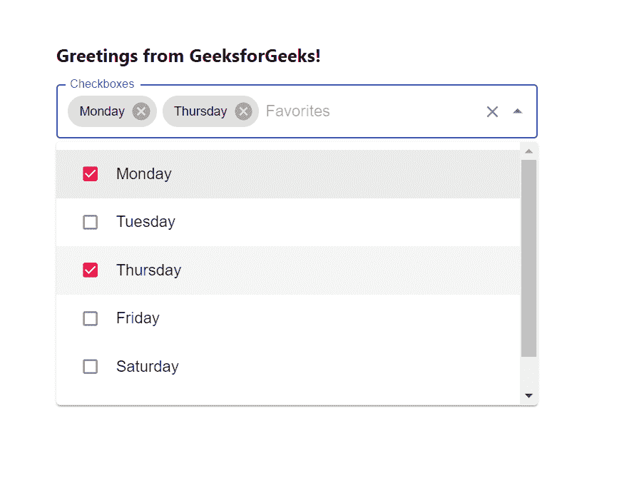

# 如何在 ReactJS 中使用复选框？

> 原文:[https://www . geeksforgeeks . org/how-用法-checks-in-reactjs/](https://www.geeksforgeeks.org/how-to-use-checkboxes-in-reactjs/)

一个**复选框**是一个图形用户界面小部件，允许用户从给定的选项中进行二进制选择。当用户只能从给定的选项中选择时，它非常有用。【React 的 Material UI 有这个组件可供我们使用，非常容易集成。

**创建反应应用程序并安装模块:**

**步骤 1:** 使用以下命令创建一个反应应用程序:

```
npx create-react-app foldername
```

**步骤 2:** 在创建项目文件夹(即文件夹名**)后，使用以下命令将**移动到该文件夹:

```
cd foldername
```

**步骤 3:** 创建 ReactJS 应用程序后，使用以下命令安装 **material-ui** 模块:

```
npm install @material-ui/core
npm install @material-ui/lab
npm install @material-ui/icons
```

**项目结构:**如下图。


项目结构

**App.js:** 现在在 **App.js** 文件中写下以下代码。在这里，App 是我们编写代码的默认组件。

## java 描述语言

```
import React from 'react'
import TextField from '@material-ui/core/TextField';
import Autocomplete from '@material-ui/lab/Autocomplete';
import Checkbox from '@material-ui/core/Checkbox';
import CheckBoxOutlineBlankIcon from '@material-ui/icons/CheckBoxOutlineBlank';
import CheckBoxIcon from '@material-ui/icons/CheckBox';

const icon = <CheckBoxOutlineBlankIcon fontSize="small" />;
const checkedIcon = <CheckBoxIcon fontSize="small" />;

const App = () => {

  // Our sample dropdown options
  const options = ['Monday', 'Tuesday', 'Thursday', 
  'Friday', 'Saturday', 'Sunday']

  return (
    <div style={{ marginLeft: '40%', marginTop: '60px' }}>
      <h3>Greetings from GeeksforGeeks!</h3>
      <Autocomplete
        multiple
        id="checkboxes-tags-demo"
        options={options}
        renderOption={(option, { selected }) => (
          <React.Fragment>
            <Checkbox
              icon={icon}
              checkedIcon={checkedIcon}
              style={{ marginRight: 8 }}
              checked={selected}
            />
            {option}
          </React.Fragment>
        )}
        style={{ width: 500 }}
        renderInput={(params) => (
          <TextField {...params} variant="outlined"
            label="Checkboxes"
            placeholder="Favorites" />
        )}
      />
    </div>
  );
}

export default App
```

**运行应用程序的步骤:**从项目的根目录使用以下命令运行应用程序:

```
npm start
```

**输出:**现在打开浏览器，转到***http://localhost:3000/***，会看到如下输出:

