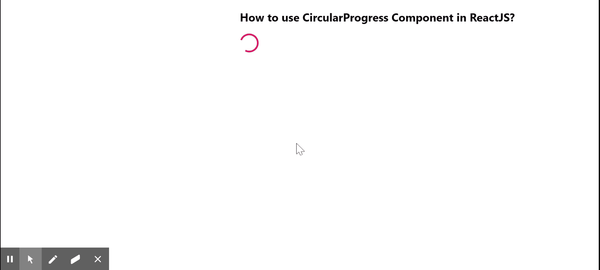

# 如何在 ReactJS 中使用循环进度组件？

> 原文:[https://www . geeksforgeeks . org/使用方法-循环进度-组件 in-reactjs/](https://www.geeksforgeeks.org/how-to-use-circularprogress-component-in-reactjs/)

正如我们所知，进度指标告知用户正在进行的进程的状态，如加载应用程序、上传数据等。我们可以在 ReactJS 中使用**循环进度**组件来显示这个循环加载效果。React 的 Material UI 有这个组件可供我们使用，非常容易集成。

**创建反应应用程序并安装模块:**

**步骤 1:** 使用以下命令创建一个反应应用程序:

```jsx
npx create-react-app foldername
```

**步骤 2:** 创建项目文件夹(即文件夹名**)后，使用以下命令移动到该文件夹中:**

```jsx
cd foldername
```

**步骤 3:** 创建 ReactJS 应用程序后，使用以下命令安装 **material-ui** 模块:

```jsx
npm install @material-ui/core
```

**项目结构:**如下图。


项目结构

**App.js:** 现在在 **App.js** 文件中写下以下代码。在这里，App 是我们编写代码的默认组件。

## java 描述语言

```jsx
import React, {useEffect, useState} from 'react';
import CircularProgress from '@material-ui/core/CircularProgress';

const App = () => {

  useEffect(()=> {
    getDataFromAPI()
  }, [])

  const [isLoading, setIsLoading] = useState(true)

  // Sample API to fetch Data
  const getDataFromAPI = () => {
    console.log("API called!!")
    fetch('http://dummy.restapiexample.com/api/v1/employees')
     .then((response) => {
      return response.json()
    }).then((res) => {
      setTimeout(()=>{
        setIsLoading(false)
      }, 2000)
    })
  }

  return (
    <div style={{
      marginLeft: '40%',
    }}>
      <h2>How to use CircularProgress Component in ReactJS?</h2>
      {isLoading && <CircularProgress color="secondary" />} 
      {!isLoading && <h3>Successfully API Loaded Data</h3>}
    </div>
  );
}

export default App;
```

**运行应用程序的步骤:**从项目的根目录使用以下命令运行应用程序:

```jsx
npm start
```

**输出:**现在打开浏览器，转到***http://localhost:3000/***，会看到如下输出:



这就是我们如何在 ReactJS 中使用**循环进度**组件显示加载效果。