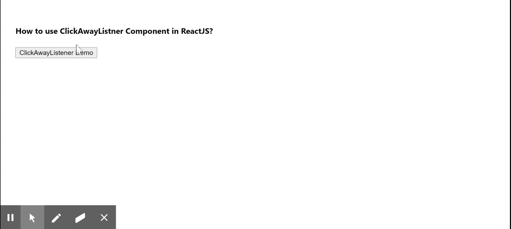

# 如何在 ReactJS 中使用 ClickAwayListener 组件？

> 原文:[https://www . geeksforgeeks . org/使用方法-clickaway listener-component-in-reactjs/](https://www.geeksforgeeks.org/how-to-use-clickawaylistener-component-in-reactjs/)

检测点击事件是否发生在元素外部。每当用户点击文档中的时，这个监听器就会工作。【React 的 Material UI 有这个组件可供我们使用，非常容易集成。我们可以使用下面的方法在 ReactJS 中使用 ClickAwayListener 组件。

**创建反应应用程序并安装模块:**

**步骤 1:** 使用以下命令创建一个 React 应用程序。

```
npx create-react-app foldername
```

**步骤 2:** 在创建项目文件夹(即文件夹名**)后，使用以下命令移动到该文件夹。**

```
cd foldername
```

**步骤 3:** 创建 ReactJS 应用程序后，使用以下命令安装 **material-ui** 模块。

```
npm install @material-ui/core
```

**项目结构:**如下图。


项目结构

**示例:**现在在 **App.js** 文件中写下以下代码。在这里，App 是我们编写代码的默认组件。

## App.js

```
import React from "react";
import { lightBlue } from "@material-ui/core/colors";
import ClickAwayListener from 
    "@material-ui/core/ClickAwayListener";

export default function App() {
  const [open, setOpen] = React.useState(false);

  const handleClickAwayEvent = () => {
    setOpen(false);
  };

  const handleClickEvent = () => {
    setOpen((prev) => !prev);
  };

  return (
    <div style={{ display: "block", padding: 30 }}>
      <h4>How to use ClickAwayListner Component in ReactJS?</h4>
      <ClickAwayListener onClickAway={handleClickAwayEvent}>
        <div
          style={{
            position: "relative",
          }}
        >
          <button type="button" onClick={handleClickEvent}>
            ClickAwayListener Demo
          </button>
          {open ? (
            <div
              style={{
                width: 150,
                position: "absolute",
                right: 0,
                fontSize: 9,
                border: "1px solid",
                left: 0,
                backgroundColor: lightBlue,
                zIndex: 1,
                padding: 3,
                top: 28,
              }}
            >
              It will be visible until you click outside this box
            </div>
          ) : null}
        </div>
      </ClickAwayListener>
    </div>
  );
}
```

**运行应用程序的步骤:**从项目的根目录使用以下命令运行应用程序。

```
npm start
```

**输出:**现在打开浏览器，转到***http://localhost:3000/***，会看到如下输出。



**参考:**T2】https://material-ui.com/components/click-away-listener/