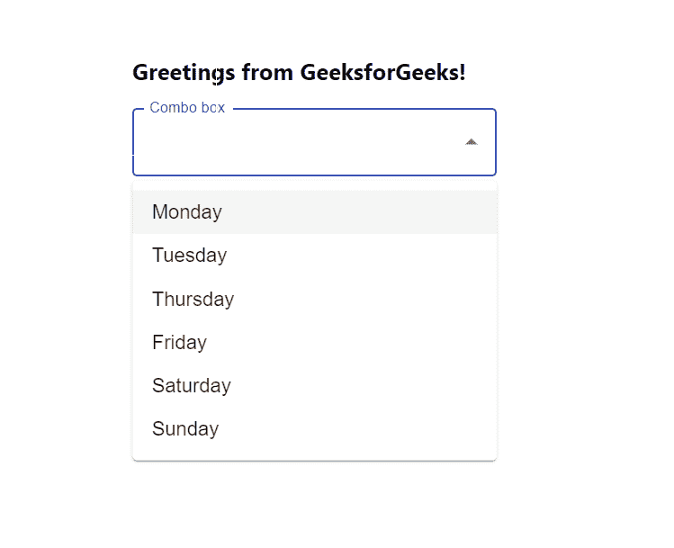

# 如何在 ReactJS 中使用 ComboBox？

> 原文:[https://www . geeksforgeeks . org/how-用法-combobox-in-reactjs/](https://www.geeksforgeeks.org/how-to-use-combobox-in-reactjs/)

一个**组合框**是一个常用的图形用户界面小部件。应用程序需要一个组合框，用户可以从中选择选项。React 的 Material UI 有这个组件可供我们使用，非常容易集成。

**创建反应应用程序并安装模块:**

**步骤 1:** 使用以下命令创建一个反应应用程序:

```jsx
npx create-react-app foldername
```

**步骤 2:** 在创建项目文件夹(即文件夹名**)后，使用以下命令将**移动到该文件夹:

```jsx
cd foldername
```

**步骤 3:** 创建 ReactJS 应用程序后，使用以下命令安装 **material-ui** 模块:

```jsx
npm install @material-ui/core
npm install @material-ui/lab
```

**项目结构:**如下图。


项目结构

**App.js:** 现在在 **App.js** 文件中写下以下代码。在这里，App 是我们编写代码的默认组件。

## java 描述语言

```jsx
import React from 'react'
import TextField from '@material-ui/core/TextField';
import Autocomplete from '@material-ui/lab/Autocomplete';

const App = () => {

  // Our sample dropdown options
  const options = ['Monday', 'Tuesday', 'Thursday', 
  'Friday', 'Saturday', 'Sunday']

  return (
    <div style={{marginLeft:'40%', marginTop: '60px'}}>
      <h3>Greetings from GeeksforGeeks!</h3>
      <Autocomplete
        options={options}
        style={{ width: 300 }}
        renderInput={(params) =>
          <TextField {...params} label="Combo box" variant="outlined" />}
      />
    </div>
  );
}

export default App
```

**运行应用程序的步骤:**从项目的根目录使用以下命令运行应用程序:

```jsx
npm start
```

**输出:**现在打开浏览器，转到***http://localhost:3000/***，会看到如下输出:

