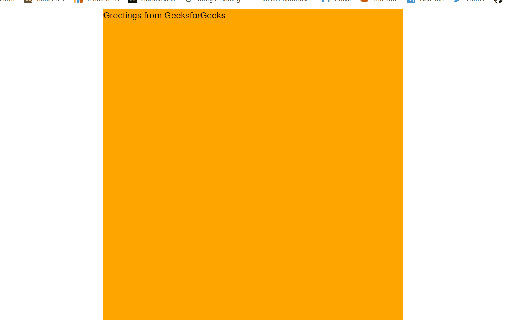

# 如何在 ReactJS 中使用容器组件？

> 原文:[https://www . geesforgeks . org/how-to-use-container-in-component-reactjs/](https://www.geeksforgeeks.org/how-to-use-container-component-in-reactjs/)

容器将您的内容水平居中。这是最基本的布局元素。React 的 Material UI 有这个组件可供我们使用，非常容易集成。我们可以使用以下方法在 ReactJS 中创建容器组件。

**创建反应应用程序并安装模块:**

**步骤 1:** 使用以下命令创建一个反应应用程序:

```
npx create-react-app foldername
```

**步骤 2:** 在创建项目文件夹(即文件夹名**)后，使用以下命令将**移动到该文件夹:

```
cd foldername
```

**步骤 3:** 创建 ReactJS 应用程序后，使用以下命令安装 **material-ui** 模块:

```
npm install @material-ui/core
```

**项目结构:**如下图。


项目结构

**App.js:** 现在在 **App.js** 文件中写下以下代码。在这里，App 是我们编写代码的默认组件。

## java 描述语言

```
import React from 'react'
import Typography from '@material-ui/core/Typography';
import Container from '@material-ui/core/Container';

const App = () => {
  return (
    <Container maxWidth="sm">
      <Typography component="div" style={{ 
        backgroundColor: 'Orange', height: '100vh' 
      }}>
        Greetings from GeeksforGeeks
      </Typography>
    </Container>
  );
}

export default App
```

**运行应用程序的步骤:**从项目的根目录使用以下命令运行应用程序:

```
npm start
```

**输出:**现在打开浏览器，转到***http://localhost:3000/***，会看到如下输出:

