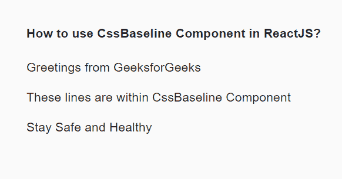
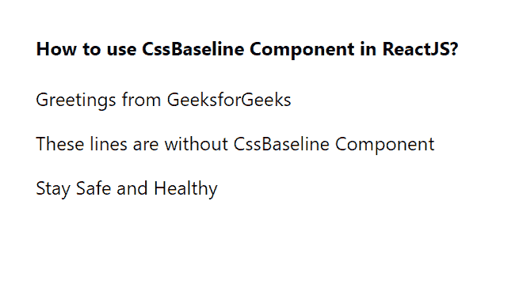

# 如何在 ReactJS 中使用 CssBaseLine 组件？

> 原文:[https://www . geesforgeks . org/how-用法-CSS baseline-component in-reactjs/](https://www.geeksforgeeks.org/how-to-use-cssbaseline-component-in-reactjs/)

一个 CssBaseline 组件是 HTML 元素和属性样式规范化的集合。在我们文档的< 头 >处，添加为 CSS 重置。该组件用于为我们的应用程序添加一些基本样式，如框尺寸、背景颜色、等，如主题顶部的 Css 重置。React 的 Material UI 有这个组件可供我们使用，非常容易集成。我们可以使用以下方法在 ReactJS 中使用 CssBaseline 组件:

**创建反应应用程序并安装模块:**

*   **步骤 1:** 使用以下命令创建一个反应应用程序:

    ```
    npx create-react-app foldername
    ```

*   **步骤 2:** 创建项目文件夹(即文件夹名**)后，使用以下命令移动到该文件夹中:**

    ```
    cd foldername
    ```

*   **步骤 3:** 创建 ReactJS 应用程序后，使用以下命令安装 **material-ui** 模块:

    ```
    npm install @material-ui/core
    ```

**项目结构:**如下图。


项目结构

**示例:**现在在 **App.js** 文件中写下以下代码。在这里，App 是我们编写代码的默认组件。

## App.js

```
import React from 'react';
import CssBaseline from '@material-ui/core/CssBaseline';

export default function App() {

  return (
    <div style={{ display: 'block', padding: 30 }}>
      <h4>How to use CssBaseline Component in ReactJS?</h4>
      <CssBaseline>
        <p>Greetings from GeeksforGeeks</p>
        <p>These lines are within CssBaseline Component</p>
        <p>Stay Safe and Healthy</p>

      </CssBaseline>
    </div>
  );
}
```

**运行应用程序的步骤:**从项目的根目录使用以下命令运行应用程序:

```
npm start
```

**输出:**现在打开浏览器，转到***http://localhost:3000/***，会看到如下输出:



现在，如果我们编写相同的示例，但不使用 CssBaseline 组件，那么输出结果如下:

## App.js

```
import React from 'react';

export default function App() {

  return (
    <div style={{ display: 'block', padding: 30 }}>
      <h4>How to use CssBaseline Component in ReactJS?</h4>
        <p>Greetings from GeeksforGeeks</p>
        <p>These lines are without CssBaseline Component</p>
        <p>Stay Safe and Healthy</p>

    </div>
  );
}
```

**运行应用程序的步骤:**从项目的根目录使用以下命令运行应用程序:

```
npm start
```

**输出:**现在打开浏览器，转到***http://localhost:3000/***，会看到如下输出:



**参考:**T2】https://material-ui.com/components/css-baseline/