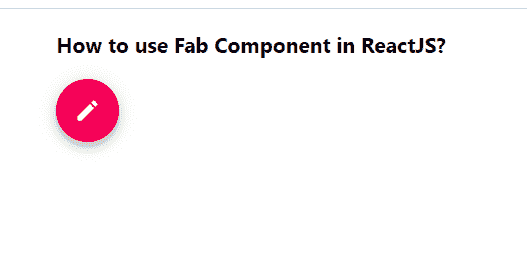

# 如何在 ReactJS 中使用 Fab 组件？

> 原文:[https://www . geeksforgeeks . org/how-用法-fab-in-component-reactjs/](https://www.geeksforgeeks.org/how-to-use-fab-component-in-reactjs/)

**Fab** 代表浮动动作按钮，它出现在所有屏幕内容的前面，通常是一个中心带有图标的圆形。React 的 Material UI 有这个组件可供我们使用，非常容易集成。它 可以用来打开或关闭一个选项。 我们可以使用**Fab**组件在 ReactJS 中使用以下方法:

**创建反应应用程序并安装模块:**

**步骤 1:** 使用以下命令创建一个反应应用程序:

```
npx create-react-app foldername
```

**步骤 2:** 在创建项目文件夹(即文件夹名**)后，使用以下命令将**移动到该文件夹:

```
cd foldername
```

**步骤 3:** 创建 ReactJS 应用程序后，使用以下命令安装 **material-ui** 模块:

```
npm install @material-ui/core
npm install @material-ui/icons
```

**项目结构:**如下图。


项目结构

**App.js:** 现在在 **App.js** 文件中写下以下代码。在这里，App 是我们编写代码的默认组件。

## java 描述语言

```
import React from 'react';
import Fab from '@material-ui/core/Fab';
import EditIcon from '@material-ui/icons/Edit';

const App = () => {

  return (
    <div style={{
      margin: 'auto',
      display: 'block',
      width: 'fit-content'
    }}>
      <h3>How to use Fab Component in ReactJS?</h3>
      <Fab color="secondary" aria-label="edit">
        <EditIcon />
      </Fab>
    </div>
  );
}

export default App;
```

**运行应用程序的步骤:**从项目的根目录使用以下命令运行应用程序:

```
npm start
```

**输出:**现在打开浏览器，转到***http://localhost:3000/***，会看到如下输出:

