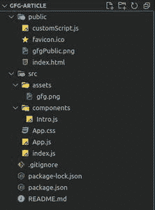
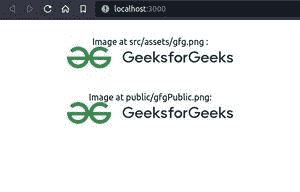
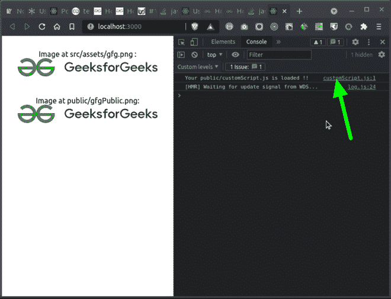

# 如何在 ReactJS 中使用公共文件夹中的文件？

> 原文:[https://www . geeksforgeeks . org/如何使用公共文件夹中的文件-in-reactjs/](https://www.geeksforgeeks.org/how-to-use-files-in-public-folder-in-reactjs/)

公共文件夹包含静态文件，如 index.html、javascript 库文件、图像和其他资产等。你不想被 webpack 处理。此文件夹中的文件直接复制并粘贴到生成文件夹中。只有“公共”文件夹中的文件可以从 HTML 中引用。

**创建反应应用程序:**

*   **步骤 1:** 使用以下命令创建一个反应应用程序:

    ```jsx
    npx create-react-app foldername
    ```

*   **步骤 2:** 创建项目文件夹(即文件夹名)后，使用以下命令移动到该文件夹:

    ```jsx
    cd foldername
    ```

**项目结构:**如下图。现在创建一个资产文件夹，并把任何样本图像放入其中，就像这里我们保留了*gfg.png*文件。此外，我们还将*gfgPublic.png*文件保存在公共文件夹中。



简单的 react app 文件夹结构

## App.js

```jsx
import Intro from './components/Intro';
import './App.css';

function App() {
  return (
    <div className="App">
      <Intro />
    </div>
  );
}

export default App;
```

对于上述文件结构，为了在**介绍**组件中显示 *src/assets/gfg.png* ，可以简单导入，如下所示:

```jsx
import gfgLogo from "../assets/gfg.png";
...

```

用于显示公用文件夹中的图像，请使用“public/gfgppublic . png”。src 属性的 URL 将是**process . env . public _ URL+"/gfgppublic . png "。**这里， **PUBLIC_URL** 将在构建过程中被替换为“PUBLIC”文件夹的 URL。

```jsx

```

## Intro.js(简介. js)

```jsx
import gfgLogo from "../assets/gfg.png";

const Intro = () => {
  return (
    <div className="App">

      Image at src/assets/gfg.png : <br />
      
      <br />

      Image at public/gfgPublic.png: <br />
      
      <br />

    </div>
  );
};

export default Intro;
```

**运行应用程序的步骤:**从项目的根目录使用以下命令运行应用程序:

```jsx
npm start
```

**输出:**现在打开浏览器，转到***http://localhost:3000/***，会看到如下输出:



要将公共文件夹中的任何 js 文件包含在 HTML 文件中，请添加以下行。在构建过程中， *%PUBLIC_URL%* 将被替换为“公共”文件夹的 URL。

```jsx
<script src="%PUBLIC_URL%/customScript.js" ></script>
```

## customScript.js

```jsx
console.log("Your public/customScript.js is loaded !!");
```

**输出:**

