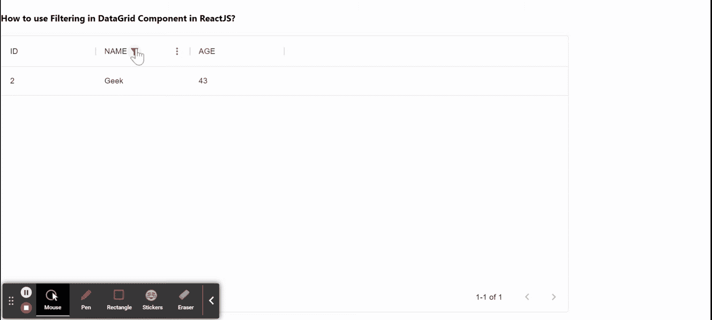

# 如何在 ReactJS 中使用数据网格组件中的过滤？

> 原文:[https://www . geeksforgeeks . org/如何使用-数据网格中的过滤-组件中的 reactjs/](https://www.geeksforgeeks.org/how-to-use-filtering-in-datagrid-component-in-reactjs/)

数据网格组件中的过滤有助于查看数据网格中的特定或相关记录。数据网格组件有助于以类似网格的行和列格式显示信息。我们可以在 ReactJS 中使用以下方法来使用数据网格组件中的过滤。

**方法:**借助 ***filterModel*** 道具，我们可以在 DataGrid Component 中进行过滤。在下面的示例中，我们将 **columnField** 作为*名称*、 **operatorValue** 作为*包含*和**值**作为 *Geek，*因此它将显示所有包含**名称**字段的行，该字段包含 *Geek* 值。

**创建反应应用程序并安装模块:**

*   **步骤 1:** 使用以下命令创建一个反应应用程序:

    ```
    npx create-react-app foldername
    ```

*   **步骤 2:** 创建项目文件夹(即文件夹名**)后，使用以下命令移动到该文件夹中:**

    ```
    cd foldername
    ```

*   **步骤 3:** 创建 ReactJS 应用程序后，使用以下命令安装 **material-ui** 模块:

    ```
    npm install @material-ui/data-grid
    ```

**项目结构:**如下图。


项目结构

**示例:**现在在 **App.js** 文件中写下以下代码。在这里，App 是我们编写代码的默认组件。

## App.js

```
import * as React from 'react';
import { DataGrid } from '@material-ui/data-grid';

const columns = [
  { field: 'id', headerName: 'ID', width: 170 },
  { field: 'name', headerName: 'NAME', width: 170 },
  { field: 'age', headerName: 'AGE', width: 170 },
];

const rows = [
  { id: 1, name: 'Gourav', age: 12 },
  { id: 2, name: 'Geek', age: 43 },
  { id: 3, name: 'Pranav', age: 41 },
];

export default function App() {
  return (
    <div style={{ height: 500, width: '80%' }}>
      <h4>
       How to use Filtering in DataGrid 
       Component in ReactJS?
      </h4>
      <DataGrid rows={rows} 
                columns={columns} 
                pageSize={2}
        filterModel={{
          items: [
            { columnField: 'name',
              operatorValue: 'contains', 
              value: 'Geek' },
          ],
        }}
      />
    </div>
  );
}
```

**运行应用程序的步骤:**从项目的根目录使用以下命令运行应用程序:

```
npm start
```

**输出:**现在打开浏览器，转到***http://localhost:3000/***，会看到如下输出:



**参考:**T2】https://material-ui.com/components/data-grid/filtering/