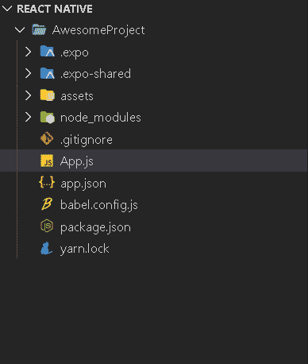

# 如何在 React Native 中使用 Flexbox？

> 原文:[https://www . geeksforgeeks . org/如何使用-flexbox-in-react-native/](https://www.geeksforgeeks.org/how-to-use-flexbox-in-react-native/)

Flexbox 用于为布局提供一致性。它用于使布局适应运行它的设备的屏幕大小。使用 flexbox 设计，您可以指定某个布局元素将跨越到可用空间的这一部分。

在 React Native 中，Flexbox 与基本 CSS 相同。唯一不同的是默认值。

*   **flex direction:**CSS 的默认值为*行*，而【反应原生】中的默认值为*列*。
*   **对齐内容:**CSS 的默认值是*拉伸*反应原生中的默认值是*伸缩启动*。
*   **flex shrink:**CSS 的默认值是 1，而 React Native 中的默认值是 0。

**现在我们从实现开始:**

*   **步骤 1:** 打开终端，通过以下命令安装 expo-cli。

    ```jsx
    npm install -g expo-cli
    ```

*   **步骤 2:** 现在通过以下命令创建一个项目。

    ```jsx
    expo init AwesomeProject
    ```

*   **第三步:**现在进入你的项目文件夹，即 AwesomeProject

    ```jsx
    cd AwesomeProject
    ```

**项目结构:**会是这样的。



项目结构

**Flex 属性:** Flex 属性将定义布局中的组件如何跨越主轴上的可用空间，默认情况下，主轴是一列。空间将按照每个元素的 flex 属性的比例来划分。

**示例:**在 **App.js** 文件中写下以下代码。

## App.js

```jsx
import React from 'react';
import {View } from 'react-native';

export default function App() {
  return (
    <View style={{
      flex: 1
    }}>
        <View style={{ flex: 4, backgroundColor: "white" }} />
        <View style={{ flex: 1, backgroundColor: "black" }} />
        <View style={{ flex: 7, backgroundColor: "green" }} />
      </View>
  );
}
```

使用以下命令启动服务器。

```jsx
npm run android
```

**输出:**如果你的模拟器没有自动打开，那么你需要手动打开。首先，去你的安卓工作室运行模拟器。现在再次启动服务器。


输出

**柔化方向属性:****柔化方向**属性控制节点子节点的布局方向，即主轴。以下给出了四种类型的弹性方向:

*   **列(默认值):**这以垂直方式从上到下对齐子代。
*   **行:**这以水平方式从左到右对齐孩子。
*   **列-反转:**这将在垂直空间中从下向上对齐子对象。
*   **行反转:**这将在水平空间中从右向左对齐子对象。

**示例:**在 **App.js** 文件中写下以下代码。

## App.js

```jsx
import React from 'react';
import {View } from 'react-native';

export default function App() {
  return (
    <View style={{
      flex: 1,
      flexDirection: "row",
    }}>
        <View style={{ flex: 4, backgroundColor: "white" }} />
        <View style={{ flex: 1, backgroundColor: "black" }} />
        <View style={{ flex: 7, backgroundColor: "green" }} />
      </View>
  );
}
```

使用以下命令启动服务器。

```jsx
npm run android
```

**输出:**如果你的模拟器没有自动打开，那么你需要手动打开。首先，去你的安卓工作室运行模拟器。现在再次启动服务器。


输出

**参考:**T2】https://reactnative.dev/docs/flexbox