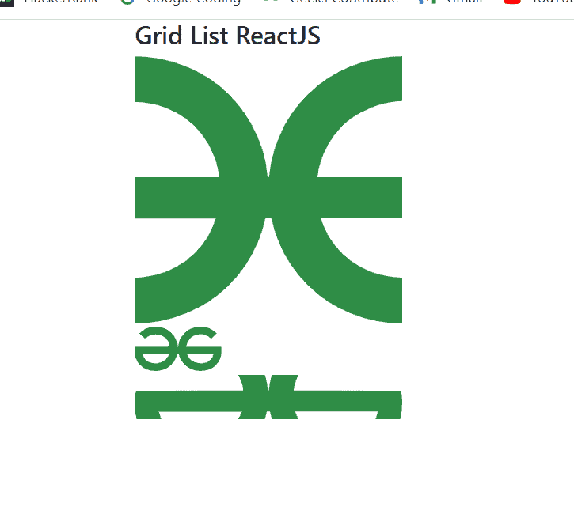

# 如何在 ReactJS 中使用 GridList？

> 原文:[https://www . geeksforgeeks . org/how-用法-gridlist-in-reactjs/](https://www.geeksforgeeks.org/how-to-use-gridlist-in-reactjs/)

网格列表以有组织的网格显示图像集合。React 的 Material UI 有这个组件可供我们使用，非常容易集成。我们可以使用以下方法在 ReactJS 中使用 GridList 组件。

**创建反应应用程序并安装模块:**

**步骤 1:** 使用以下命令创建一个反应应用程序:

```
npx create-react-app foldername
```

**步骤 2:** 创建项目文件夹(即文件夹名**)后，使用以下命令移动到该文件夹中:**

```
cd foldername
```

**步骤 3:** 创建 ReactJS 应用程序后，使用以下命令安装 **material-ui** 模块:

```
npm install @material-ui/core
```

**项目结构:**如下图。


项目结构

**文件名-App.js:** 现在在 **App.js** 文件中写下以下代码。在这里，App 是我们编写代码的默认组件。

## java 描述语言

```
import React from 'react';
import { makeStyles } from '@material-ui/core/styles';
import GridList from '@material-ui/core/GridList';
import GridListTile from '@material-ui/core/GridListTile';

const App = () => {
  return (
    <div style={{ width: 300, margin: 'auto' }}>
      <h3>Grid List ReactJS</h3>
      <GridList cellHeight={50} cols={3}>
        <GridListTile rows={6} cols={3}>
          
        </GridListTile>
        <GridListTile cols={1}>
          
        </GridListTile>
        <GridListTile cols={3}>
          
        </GridListTile>
      </GridList>
    </div>
  );
}

export default App;
```

**运行应用程序的步骤:**从项目的根目录使用以下命令运行应用程序:

```
npm start
```

**输出:**现在打开浏览器，转到***http://localhost:3000/***，会看到如下输出:

