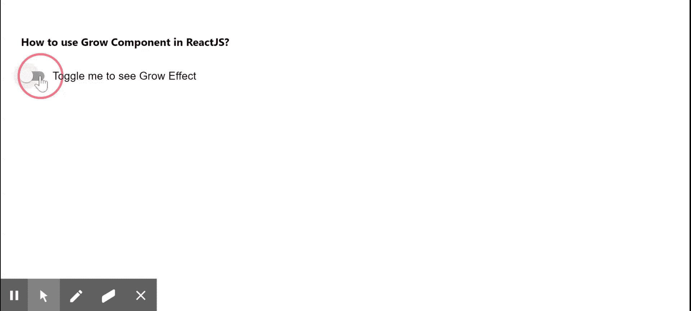

# 如何在 ReactJS 中使用 Grow 组件？

> 原文:[https://www . geeksforgeeks . org/how-to-use-grow-in-component-reactjs/](https://www.geeksforgeeks.org/how-to-use-grow-component-in-reactjs/)

增长组件向子元素或组件添加增长动画。React 的 Material UI 有这个组件可供我们使用，非常容易集成。我们可以使用以下方法在 ReactJS 中使用增长组件。

**创建反应应用程序并安装模块:**

**步骤 1:** 使用以下命令创建一个 React 应用程序。

```
npx create-react-app foldername
```

**步骤 2:** 在创建项目文件夹(即文件夹名**)后，使用以下命令移动到该文件夹。**

```
cd foldername
```

**步骤 3:** 创建 ReactJS 应用程序后，使用以下命令安装 **material-ui** 模块。

```
npm install @material-ui/core
```

**项目结构:**


项目结构

**示例:**现在在 **App.js** 文件中写下以下代码。在这里，App 是我们编写代码的默认组件。

## App.js

```
import React from "react";
import FormControlLabel from "@material-ui/core/FormControlLabel";
import Paper from "@material-ui/core/Paper";
import Switch from "@material-ui/core/Switch";
import Grow from "@material-ui/core/Grow";

export default function App() {
  const [isChecked, setIsChecked] = React.useState(false);

  return (
    <div style={{ display: "block", padding: 30 }}>
      <h4>How to use Grow Component in ReactJS?</h4>
      <FormControlLabel
        control={
          <Switch
            checked={isChecked}
            onChange={() => {
              setIsChecked((prev) => !prev);
            }}
          />
        }
        label="Toggle me to see Grow Effect"
      />
      <div style={{ display: "flex" }}>
        <Grow in={isChecked}>
          <Paper elevation={5} style={{ margin: 5 }}>
            <svg style={{ width: 100, height: 100 }}>
              <polygon
                points="0,80 45,00, 80,70"
                style={{
                  fill: "orange",
                  stroke: "dimgrey",
                  strokeWidth: 1,
                }}
              />
            </svg>
          </Paper>
        </Grow>
      </div>
    </div>
  );
}
```

**运行应用程序的步骤:**从项目的根目录使用以下命令运行应用程序。

```
npm start
```

**输出:**现在打开浏览器，转到***http://localhost:3000/***，会看到如下输出。



**参考:**T2】https://material-ui.com/components/transitions/#grow